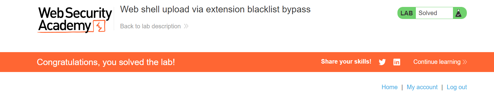

# PortSwigger Labs: File Upload vulnerabilities

[PortSwigger Cheat sheet](https://portswigger.net/web-security/sql-injection/cheat-sheet)

[PortSwigger Labs](https://portswigger.net/web-security/all-labs#file-upload-vulnerabilities)

## Lab 01: Remote code execution via web shell upload
[Link](https://portswigger.net/web-security/file-upload/lab-file-upload-remote-code-execution-via-web-shell-upload)


I try to upload a python script file. It seems that the website doesn't check the MIME type of the upload file.


Then when i back to my-account page, there is a request that GET /files/avatars/[file-upload].


I can access the uploaded file.


So what if the uploaded file is something like this:
```
<?php
$file = '/home/carlos/secret'; 

if (file_exists($file)) {
    $content = file_get_contents($file);
    echo $content;
} else {
    echo 'File does not exist.';
}
?>
```


## Lab 02: Web shell upload via Content-Type restriction bypass
[Link](https://portswigger.net/web-security/file-upload/lab-file-upload-web-shell-upload-via-content-type-restriction-bypass)


Same as lab 01, i tried to upload sth to the server. However, the server returned an error:


So the server only accepts image/jpeg and image/png.
But the server just check the value of the "Content-Type" header, not the file itself or the file extension.


## Lab 03: Web shell upload via path traversal
[Link](https://portswigger.net/web-security/file-upload/lab-file-upload-web-shell-upload-via-path-traversal)


I uploaded the lab_01.php file to the server.


It seems that the server handles the file as text instead of php script. Maybe i should move the file out of the /files directory.


:>


## Lab 04: Web shell upload via extension blacklist bypass
[Link](https://portswigger.net/web-security/file-upload/lab-file-upload-web-shell-upload-via-extension-blacklist-bypass)

The upload functionality blocks the php file extension. Also the server blocks execution of the php file.

So i add a new type to .htaccess for handling my custom file extension as an php script.


Resend the request with the new file name lab_01.ahihi


Got it!




## Lab 05: Web shell upload via obfuscated file extension
[Link](https://portswigger.net/web-security/file-upload/lab-file-upload-web-shell-upload-via-obfuscated-file-extension)


Only jpg and png files are allowed


:> i think i should put a character between ".php" and ".jpg" to break the path.
-> lab_01.php%00.jpg


Done!


## Lab 06: Remote code execution via polyglot web shell upload
[Link](https://portswigger.net/web-security/file-upload/lab-file-upload-remote-code-execution-via-polyglot-web-shell-upload)


:> seems like the server check the file content

I uploaded a valid image file


-> Maybe the server checks the image header signature.

-> I can add a png header signature before the php script


Then send the request


Done!


## Lab 07: Web shell upload via race condition
[Link](https://portswigger.net/web-security/file-upload/lab-file-upload-web-shell-upload-via-race-condition)

Lab description:
```
This lab contains a vulnerable image upload function. Although it performs robust validation on any files that are uploaded, it is possible to bypass this validation entirely by exploiting a race condition in the way it processes them.
```

Race condition: [PortSwigger](https://portswigger.net/web-security/race-conditions)

Turbo Intruder: [PortSwigger](https://portswigger.net/research/turbo-intruder-embracing-the-billion-request-attack)

-> I can bypass the upload validation by running a race condition attack. Tubro Intruder can be used to send multiple requests at the same time.

I need to send 2 requests: one POST request to send the exploit.php file, one GET request to get the exploit.php content.

